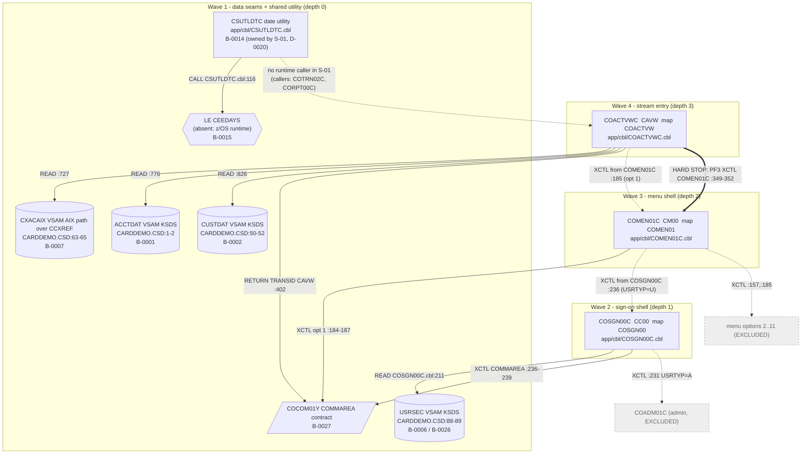

# S-01 AccountView — stream analysis (`!mf_stream_analysis`)

| Item | Value |
|---|---|
| Module | CardDemo core (`functional/CardDemo/CardDemo_inventory.md`) |
| Stream | **S-01 AccountView** — confirmed at STOP B (`.migration/06_decisions.md` D-0019) |
| Process type | **ONLINE** (CICS pseudo-conversational; confirmed D-0019) |
| Entry | trancode `CAVW` -> program `COACTVWC`, mapset `COACTVW` (`app/csd/CARDDEMO.CSD:317-318`, `:181-185`, `:105`) |
| Hard stop | `EXEC CICS XCTL PROGRAM(CDEMO-TO-PROGRAM)` back to `COMEN01C` (`app/cbl/COACTVWC.cbl:349-352`) |
| Exclusions | `CAUP`/`COACTUPC` and menu options 2..11; `COADM01C` admin branch of sign-on. The menu shell renders, only option 1 is live. |
| Shared programs owned here | `COSGN00C`, `COMEN01C`, `CSUTLDTC` (D-0020) |
| Target profiles used | CORE + ONLINE + DATA/BOUNDARY (`functional/CardDemo/CardDemo_target_state.md`); BATCH/SUBTRANSACTION N/A |
| Evidence policy | Source-derived only (no mainframe). Every behaviour claim cites `<file>:<line>`. `spring-boot/` is reference evidence, never copied. |
| Branch | `devin/1788757216-cardemo-account-view-stream` |

Boundary taxonomy B1..B11 is the one defined in the `!mf_boundary_resolution` playbook (B1 intra-stream call, B2 shared module, B3 foreign subroutine, B4 data-access leaf, B5 cross-transaction switch, B6 queue/event, B7 dataset hand-off, B8 online-to-batch, B9 scheduler, B10 shared data contract, B11 external system). The repository register keeps its own `Kind` column; both are given per row.

---

## 1. Pinned stream (source trace)

### 1.1 Runtime chain

```
terminal  --CC00-->  COSGN00C  --READ USRSEC-->  password match, USRTYP='U'
          --XCTL COMMAREA-->  COMEN01C (CM00)  --option 1 XCTL COMMAREA-->  COACTVWC (CAVW)
          --READ CXACAIX --> READ ACCTDAT --> READ CUSTDAT --> SEND MAP COACTVW --> RETURN TRANSID(CAVW)
          --PF3-->  XCTL COMEN01C   <== HARD STOP
```

| Step | Behaviour | Cite |
|---|---|---|
| CSD | `CC00 -> COSGN00C`, `CM00 -> COMEN01C`, `CAVW -> COACTVWC`; mapsets `COSGN00`, `COMEN01`, `COACTVW` | `app/csd/CARDDEMO.CSD:378-379`, `:399-400`, `:317-318`; `:141`, `:133`, `:105`; programs `:249-253`, `:235-240`, `:181-185` |
| Sign-on first entry | `EIBCALEN = 0` -> clear map, send sign-on screen | `app/cbl/COSGN00C.cbl:80-85` |
| Sign-on AID dispatch | ENTER -> `PROCESS-ENTER-KEY`; PF3 -> thank-you text + `RETURN` (session ends); other -> "Invalid key" | `COSGN00C.cbl:86-96`, `:162-172` |
| Sign-on edits | user id blank -> "Please enter User ID ..."; password blank -> "Please enter Password ..."; both upper-cased | `COSGN00C.cbl:110-140` |
| USRSEC read | `READ DATASET(WS-USRSEC-FILE='USRSEC') INTO SEC-USER-DATA RIDFLD(WS-USER-ID) RESP RESP2` | `COSGN00C.cbl:207-219`, file literal `:36` |
| Sign-on routing | `RESP=NORMAL` and `SEC-USR-PWD = WS-USER-PWD`: fill COMMAREA (`CDEMO-FROM-TRANID/PROGRAM`, `CDEMO-USER-ID`, `CDEMO-USER-TYPE`, `CDEMO-PGM-CONTEXT=0`); `CDEMO-USRTYP-ADMIN` -> XCTL `COADM01C` (**excluded**); else XCTL `COMEN01C` with COMMAREA | `COSGN00C.cbl:221-239` |
| Sign-on failures | wrong password -> "Wrong Password. Try again ..."; `RESP=NOTFND` -> "User not found. Try again ..."; other RESP -> "Unable to verify the User ..." | `COSGN00C.cbl:241-257` |
| Pseudo-conversation | `RETURN TRANSID(WS-TRANID='CC00') COMMAREA(CARDDEMO-COMMAREA)` | `COSGN00C.cbl:98-102`, tranid `:35` |
| Menu entry | `EIBCALEN = 0` -> XCTL to `COSGN00C` (no COMMAREA); else copy `DFHCOMMAREA`, if not `CDEMO-PGM-REENTER` set REENTER, clear map, `SEND-MENU-SCREEN`; else AID dispatch | `app/cbl/COMEN01C.cbl:82-110` |
| Menu option parse | `OPTIONI` right-justified, blanks -> '0', moved to `WS-OPTION PIC 9(02)`; numeric check; `0` or `> CDEMO-MENU-OPT-COUNT (11)` -> "Please enter a valid option number..." | `COMEN01C.cbl:115-134`; `app/cpy/COMEN02Y.cpy:21` |
| Admin-only guard | `CDEMO-MENU-OPT-USRTYPE(WS-OPTION)='A'` and user `U` -> "No access - Admin Only option..." (unreachable: all 11 entries are `U`) | `COMEN01C.cbl:136-143`; `COMEN02Y.cpy:29,35,...,90` |
| **Option 1 dispatch** | `WHEN OTHER`: set `CDEMO-FROM-TRANID/PROGRAM`, `CDEMO-PGM-CONTEXT=0`, `XCTL PROGRAM(CDEMO-MENU-OPT-PGMNAME(WS-OPTION)) COMMAREA(CARDDEMO-COMMAREA)`; entry 1 = `'COACTVWC'` | `COMEN01C.cbl:177-188`; `COMEN02Y.cpy:25-29` |
| Excluded routes | option 11 `COPAUS0C` via `INQUIRE PROGRAM` guard (`:147-167`); `DUMMY*` placeholder route (`:169-176`, no entry today); options 2..10 (`COMEN02Y.cpy:31-84`); PF3 -> XCTL `COSGN00C` (`:196-203`) | `COMEN01C.cbl:145-203` |
| Menu pseudo-conversation | `RETURN TRANSID('CM00') COMMAREA` | `COMEN01C.cbl:107-110`, tranid `:35` |
| AccountView main | `HANDLE ABEND LABEL(ABEND-ROUTINE)`; initialise work areas; `EIBCALEN = 0` -> ENTER context; else copy `DFHCOMMAREA` into `CARDDEMO-COMMAREA` + `WS-THIS-PROGCOMMAREA` | `app/cbl/COACTVWC.cbl:262-293` |
| PF-key normalisation | `COPY 'CSSTRPFY'` maps `EIBAID` to `CCARD-AID-*`; only ENTER and PF3 valid, any other -> ENTER | `COACTVWC.cbl:299-321`, `:910-913`; `app/cpy/CSSTRPFY.cpy:17-82` |
| First entry from menu | `CDEMO-PGM-ENTER` and `CDEMO-FROM-PROGRAM = 'COMEN01C'` -> `INITIALIZE CARDDEMO-COMMAREA` + `WS-THIS-PROGCOMMAREA`, `SET CDEMO-PGM-ENTER`, then `3000-SEND-MAP` | `COACTVWC.cbl:281-288`, `:355-365` |
| Re-entry (ENTER) | `2000-PROCESS-INPUTS` -> `2100-RECEIVE-MAP` + `2200-EDIT-MAP-INPUTS`; on `INPUT-ERROR` re-send map with message; else `9000-READ-ACCT` then `3000-SEND-MAP` | `COACTVWC.cbl:366-383`, `:596-606` |
| Account-id edit | blank/low-values -> `FLG-ACCTFILTER-BLANK` + "Account number not provided" / "No input received"; not numeric or zero -> `FLG-ACCTFILTER-NOT-OK` + "Account Filter must  be a non-zero 11 digit number"; else `CDEMO-ACCT-ID <- CC-ACCT-ID` | `COACTVWC.cbl:622-685` |
| Read chain | `9200-GETCARDXREF-BYACCT` (CXACAIX) -> if `FLG-ACCTFILTER-NOT-OK` exit; `9300-GETACCTDATA-BYACCT` (ACCTDAT); `9400-GETCUSTDATA-BYCUST` (CUSTDAT) | `COACTVWC.cbl:690-715` |
| Map output | header (`COTTL01Y` titles, tranid, program, date/time), account + customer fields, `ERRMSGO`; `SEND MAP('CACTVWA') MAPSET('COACTVW') FROM(CACTVWAO) CURSOR ERASE FREEKB RESP` | `COACTVWC.cbl:417-534`, `:577-590`; `app/cpy/COTTL01Y.cpy:17-24` |
| Pseudo-conversation | `RETURN TRANSID(LIT-THISTRANID='CAVW') COMMAREA(WS-COMMAREA)` | `COACTVWC.cbl:394-406`, literal `:145-146` |
| **Hard stop** | `CCARD-AID-PFK03`: `CDEMO-TO-PROGRAM <- CDEMO-FROM-PROGRAM` if set else `LIT-MENUPGM='COMEN01C'`; stamp FROM fields, `CDEMO-USRTYP-USER`, `CDEMO-PGM-ENTER`, last map/mapset; `XCTL PROGRAM(CDEMO-TO-PROGRAM) COMMAREA(CARDDEMO-COMMAREA)` | `COACTVWC.cbl:323-352`; literal `:170-171` |

Observation (FACT, source-derived): because the first entry from the menu `INITIALIZE`s `CARDDEMO-COMMAREA` (`COACTVWC.cbl:283-286`), `CDEMO-FROM-PROGRAM` is spaces on every later re-entry, so PF3 always resolves `CDEMO-TO-PROGRAM` to `'COMEN01C'` (`:333-339`). The hard stop is therefore statically `COMEN01C`. Side effect: `CDEMO-USER-ID` is cleared on entry and `COMEN01C` receives a COMMAREA with `CDEMO-USER-TYPE='U'` but a blank user id (`:344`). The target must carry the user identity in the session instead (see risk R-08).

### 1.2 Stream boundary statement
- **In scope**: `COSGN00C` (regular-user path), `COMEN01C` (render, option validation, option-1 dispatch, PF3 exit), `COACTVWC` (all paths), `CSUTLDTC` (ported as shared utility, D-0020), the four VSAM leaves `USRSEC`, `CXACAIX`, `ACCTDAT`, `CUSTDAT`, the COMMAREA contract `COCOM01Y`.
- **Excluded (documented, not analysed)**: `COSGN00C.cbl:230-234` XCTL `COADM01C`; `COMEN01C.cbl:145-176` option 11 / DUMMY routes; `COMEN01C.cbl:177-188` for options 2..10 (`COACTUPC`, `COCRDLIC`, `COCRDSLC`, `COCRDUPC`, `COTRN00C`, `COTRN01C`, `COTRN02C`, `CORPT00C`, `COBIL00C`); `COMEN01C.cbl:196-203` PF3 back to sign-on is the menu's *exit* route and is kept as shell behaviour but owns no new program.
- Entry point is live: `CAVW` is `STATUS(ENABLED)` (`CARDDEMO.CSD:317-318`) and reachable from menu entry 1 (`COMEN02Y.cpy:25-29`).

---

## 2. Program inventory

| # | Program | Source | Present | Role | Callees / crossings | Shared (inventory §6) | Owner |
|---|---|---|---|---|---|---|---|
| 1 | `COSGN00C` | `app/cbl/COSGN00C.cbl` | yes | entry / sign-on screen / validate | READ `USRSEC` (`:211`); XCTL `COMEN01C` (`:236`), XCTL `COADM01C` (`:231`, excluded); ASSIGN APPLID/SYSID (`:198-204`); RETURN TRANSID CC00 (`:98`) | **shared** — all online streams (`CardDemo_inventory.md:253`) | S-01 |
| 2 | `COMEN01C` | `app/cbl/COMEN01C.cbl` | yes | dispatch / menu screen | XCTL by option table (`:185`), INQUIRE PROGRAM (`:148`, excluded route), XCTL `COSGN00C` (`:201-203`), RETURN TRANSID CM00 (`:107`) | **shared** — S-01..S-10, S-13 (`inventory:254`) | S-01 |
| 3 | `COACTVWC` | `app/cbl/COACTVWC.cbl` | yes | stream entry / read / validate / screen | READ `CXACAIX` (`:727`), `ACCTDAT` (`:776`), `CUSTDAT` (`:826`); SEND/RECEIVE map (`:583`, `:611`); XCTL `CDEMO-TO-PROGRAM` (`:349`); RETURN TRANSID CAVW (`:402`); HANDLE ABEND / ABEND (`:264`, `:930-936`) | stream-private (`inventory:226`) | S-01 |
| 4 | `CSUTLDTC` | `app/cbl/CSUTLDTC.cbl` | yes | shared utility (date validation) | CALL `CEEDAYS` (`:116`) | **shared** — S-08, S-09 callers (`inventory:255`); no caller in S-01 | S-01 (D-0020) |
| 5 | `CEEDAYS` | — (z/OS Language Environment) | **absent** (runtime service) | external utility | — | framework runtime (`inventory:54`) | n/a (B-0015) |
| 6 | `COADM01C` | `app/cbl/COADM01C.cbl` | yes | admin menu | — | S-11 | **excluded** from S-01 |
| 7 | menu options 2..11 targets | various | 10 present, 1 out-of-module (`COPAUS0C`) | — | — | — | **excluded** |

Copybooks executed with the stream (contract-only, no program): `COCOM01Y` (COMMAREA), `COMEN02Y` (menu table), `CVACT01Y`, `CVCUS01Y`, `CVACT03Y`, `CSUSR01Y` (records), `CVCRD01Y`, `CSSTRPFY`, `CSDAT01Y`, `CSMSG01Y`, `CSMSG02Y`, `COTTL01Y`, `CVACT02Y` (card record: copied at `COACTVWC.cbl:248`, **never referenced** by a statement in the program), symbolic maps `app/cpy-bms/COSGN00.CPY`, `COMEN01.CPY`, `COACTVW.CPY`; CICS `DFHAID`, `DFHBMSCA` (IBM-supplied, absent in repo — `.migration/07_runbook.md`).

### 2.1 Leaf-first DAG


Source: `functional/CardDemo/diagrams/AccountView_dag.mmd` (rendered with `npx @mermaid-js/mermaid-cli`).



Depth is measured over *dependency* edges (a program depends on what it reads or hands off to). XCTL hops between the three screen programs are navigation, not call-return; they are shown dashed and ordered by the user's path (sign-on before menu before view) so that each wave can be exercised end-to-end from the entry screen.

---

## 3. Surfaces (ONLINE)

Attribute conventions from BMS: `UNPROT` = user-enterable; `ASKIP`/`PROT` = display-only; `FSET` = always transmitted; `IC` = initial cursor; `DRK` = non-display; `BRT` = highlighted; `NUM` = numeric shift.

### 3.1 `COSGN00C` — map `COSGN0A` / mapset `COSGN00` (`app/bms/COSGN00.bms`, `app/cpy-bms/COSGN00.CPY`)

**INPUT fields**

| Field | BMS | Symbolic | Attributes | Edit rules (program) | Label (source) |
|---|---|---|---|---|---|
| `USERID` | `LENGTH=8 POS=(19,43)` `COSGN00.bms:156-160` | `USERIDI PIC X(8)` `COSGN00.CPY:72` | `FSET,IC,NORM,UNPROT`, GREEN | mandatory: `SPACES OR LOW-VALUES` -> "Please enter User ID ..." (`COSGN00C.cbl:115-119`); upper-cased (`:130`); key to USRSEC `RIDFLD(WS-USER-ID) PIC X(08)` (`:37`, `:215`) | `'User ID     :'` `bms:151-155`; hint `'(8 Char)'` `bms:165-169` |
| `PASSWD` | `LENGTH=8 POS=(20,43)` `bms:175-180` | `PASSWDI PIC X(8)` `CPY:78` | `DRK,FSET,UNPROT`, `INITIAL='________'` | mandatory: -> "Please enter Password ..." (`:121-125`); upper-cased (`:131`); compared byte-equal to `SEC-USR-PWD` (`:224`) | `'Password    :'` `bms:170-174`; hint `'(8 Char)'` |

**DISPLAY-only fields**: `TRNNAME X(4)`, `TITLE01 X(40)`, `CURDATE X(8) 'mm/dd/yy'`, `PGMNAME X(8)`, `TITLE02 X(40)`, `CURTIME X(9) 'Ahh:mm:ss'`, `APPLID X(8)`, `SYSID X(8)` (`bms:34-93`; populated `COSGN00C.cbl:178-204`), `ERRMSG X(78)` red bright (`bms:196-199`; `:149`), constant text incl. banner rows 5-17 and `'ENTER=Sign-on  F3=Exit'` (`bms:94-149`, `:200-204`).
AID keys: ENTER = sign-on, PF3 = exit (`COSGN00C.cbl:86-96`). Cross-field rule: none beyond both mandatory; password check happens only after both present (`:132-134`).

### 3.2 `COMEN01C` — map `COMEN1A` / mapset `COMEN01` (`app/bms/COMEN01.bms`, `app/cpy-bms/COMEN01.CPY`)

**INPUT fields**

| Field | BMS | Symbolic | Attributes | Edit rules | Label |
|---|---|---|---|---|---|
| `OPTION` | `LENGTH=2 POS=(20,41)` `COMEN01.bms:145-149` | `OPTIONI PIC X(2)` (`COMEN01.CPY`, field `OPTIONI`) | `FSET,IC,NORM,NUM,UNPROT`, `HILIGHT=UNDERLINE` | right-justify, blanks -> `'0'` (`COMEN01C.cbl:122-124`); must be numeric, `> 0`, `<= 11` (`:127-134`); admin-only guard (`:136-143`, unreachable today); allowed values 1..11 with **only 1 live in S-01** | `'Please select an option :'` `bms:140-144` |

**DISPLAY-only**: header `TRNNAME`, `TITLE01`, `CURDATE`, `PGMNAME`, `TITLE02`, `CURTIME` (`bms:34-74`; `COMEN01C.cbl:240-256`), `'Main Menu'` (`bms:75-79`), `OPTN001..OPTN012 X(40)` built as `nn. <name>` from `COMEN02Y` (`bms:80-139`; `COMEN01C.cbl:262-303`; names `COMEN02Y.cpy:26-89`), `ERRMSG X(78)` (`bms:154-157`), footer `'ENTER=Continue  F3=Exit'` (`bms:158-162`). Option labels for S-01: `01. Account View` (`COMEN02Y.cpy:26-27`); the other ten labels render but route to excluded streams.

### 3.3 `COACTVWC` — map `CACTVWA` / mapset `COACTVW` (`app/bms/COACTVW.bms`, `app/cpy-bms/COACTVW.CPY`)

**INPUT field (the only one)**

| Field | BMS | Symbolic | Attributes | Edit rules | Label |
|---|---|---|---|---|---|
| `ACCTSID` | `LENGTH=11 POS=(5,38) PICIN='99999999999'` `COACTVW.bms:84-89` | `ACCTSIDL COMP S9(4)`, `ACCTSIDI PIC 99999999999`, `ACCTSIDO X(11)` `COACTVW.CPY:55-60`, `:284` | `FSET,IC,NORM,UNPROT`, GREEN, `HILIGHT=UNDERLINE` | received into `CC-ACCT-ID` (`COACTVWC.cbl:617`); blank/low-values -> `INPUT-ERROR`, `FLG-ACCTFILTER-BLANK`, `WS-PROMPT-FOR-ACCT` = "Account number not provided" (`:651-660`, literal `:121-122`); `NOT NUMERIC` or `= ZEROES` -> `INPUT-ERROR`, `FLG-ACCTFILTER-NOT-OK`, "Account Filter must  be a non-zero 11 digit number" (`:666-677`); valid -> `FLG-ACCTFILTER-ISVALID`, copied to `CDEMO-ACCT-ID` (`:678-685`); blank also sets `NO-SEARCH-CRITERIA-RECEIVED` = "No input received" at map-edit level (`:640-642`); field attribute `DFHBMFSE` and cursor placement in `1300-SETUP-SCREEN-ATTRS` (`:536-575`) | `'Account Number :'` `bms:79-83` |

**DISPLAY-only fields** (all `ASKIP`/protected by omission of `UNPROT`; `PICOUT` where present) — populated at `COACTVWC.cbl:417-534`:

| Field | LENGTH/PICOUT | Source field | Cite |
|---|---|---|---|
| `ACSTTUS` | 1 | `ACCT-ACTIVE-STATUS` | `bms:97-100`; `cbl:474` |
| `ADTOPEN` | 10 | `ACCT-OPEN-DATE` | `bms:107-109`; `cbl:481` |
| `ACRDLIM` | 15 `+ZZZ,ZZZ,ZZZ.99` | `ACCT-CREDIT-LIMIT` | `bms:117-121`; `cbl:475` |
| `AEXPDT` | 10 | `ACCT-EXPIRAION-DATE` | `bms:128-130`; `cbl:482` |
| `ACSHLIM` | 15 `+ZZZ,ZZZ,ZZZ.99` | `ACCT-CASH-CREDIT-LIMIT` | `bms:138-142`; `cbl:476` |
| `AREISDT` | 10 | `ACCT-REISSUE-DATE` | `bms:149-151`; `cbl:483` |
| `ACURBAL` | 15 `+ZZZ,ZZZ,ZZZ.99` | `ACCT-CURR-BAL` | `bms:159-163`; `cbl:477` |
| `ACRCYCR` | 15 `+ZZZ,ZZZ,ZZZ.99` | `ACCT-CURR-CYC-CREDIT` | `bms:171-175`; `cbl:478` |
| `AADDGRP` | 10 | `ACCT-GROUP-ID` | `bms:182-184`; `cbl:485` |
| `ACRCYDB` | 15 `+ZZZ,ZZZ,ZZZ.99` | `ACCT-CURR-CYC-DEBIT` | `bms:192-196`; `cbl:479` |
| `ACSTNUM` | 9 | `CUST-ID` | `bms:207-209`; `cbl:494` |
| `ACSTSSN` | 12 | `CUST-SSN` formatted `nnn-nn-nnnn` | `bms:216-218`; `cbl:496-503` |
| `ACSTDOB` | 10 | `CUST-DOB-YYYY-MM-DD` | `bms:225-227`; `cbl:504` |
| `ACSTFCO` | 3 | `CUST-FICO-CREDIT-SCORE` | `bms:234-236`; `cbl:505` |
| `ACSFNAM`/`ACSMNAM`/`ACSLNAM` | 25 each | `CUST-FIRST/MIDDLE/LAST-NAME` | `bms:251-263`; `cbl:506-508` |
| `ACSADL1`, `ACSADL2`, `ACSCITY` | 50 each | `CUST-ADDR-LINE-1/2/3` | `bms:268-270`, `:282-284`, `:301-303`; `cbl:509-511` |
| `ACSSTTE` | 2 | `CUST-ADDR-STATE-CD` | `bms:277-279`; `cbl:512` |
| `ACSZIPC` | 5 right-justified | `CUST-ADDR-ZIP` (X(10) truncated) | `bms:291-294`; `cbl:514` |
| `ACSCTRY` | 3 | `CUST-ADDR-COUNTRY-CD` | `bms:310-312`; `cbl:513` |
| `ACSPHN1`, `ACSPHN2` | 13 each | `CUST-PHONE-NUM-1/2` (X(15) truncated) | `bms:319-321`, `:335-337`; `cbl:515-516` |
| `ACSGOVT` | 20 | `CUST-GOVT-ISSUED-ID` | `bms:326-328`; `cbl:517` |
| `ACSEFTC` | 10 | `CUST-EFT-ACCOUNT-ID` | `bms:342-344`; `cbl:518` |
| `ACSPFLG` | 1 | `CUST-PRI-CARD-HOLDER-IND` | `bms:351-353`; `cbl:519` |
| `INFOMSG` | 45 | `CCARD-ERROR-MSG`/prompt | `bms:356-360`; `cbl:526-533` |
| `ERRMSG` | 78 red bright | `WS-RETURN-MSG` | `bms:365-368`; `cbl:532` |
| header `TRNNAME`, `TITLE01/02`, `CURDATE`, `PGMNAME`, `CURTIME`; footer `'  F3=Exit '` | | | `bms:34-74`, `:369-373`; `cbl:417-445` |

Cross-field rule: account/customer blocks are shown only when `FOUND-ACCT-IN-MASTER OR FOUND-CUST-IN-MASTER` (`cbl:471-472`), customer block only when `FOUND-CUST-IN-MASTER` (`:493`). Screen labels: `'View Account'`, `'Customer Details'`, and the field labels above (`bms:75-78`, `:199-202`, `:79-350`). Decimal/money display uses BMS `PICOUT` — the target must reproduce the sign and thousands separators explicitly.

### 3.4 Surface `none`
`CSUTLDTC` (called subprogram, no CICS verbs, `CSUTLDTC.cbl`), `CEEDAYS` (LE), all data leaves.

---

## 4. Data and field dictionary

DCLGEN: **none exists** — all four files are VSAM; the copybook line is the FACT source. Target mapping follows CORE rules (`CardDemo_target_state.md:89`, `:143`): `PIC 9(n)` identifiers -> `Long`/`BIGINT`; `PIC S9(n)V99` -> `BigDecimal`/`NUMERIC(19,2)`; `PIC X(10)` dates -> `LocalDate`/`DATE`; `PIC X(n)` -> `String`/`VARCHAR(n)`; `PIC 9(3)` -> `Integer`/`INTEGER`. Rows marked INFERRED are where the source PIC does not by itself determine the target semantics.

### 4.1 Physical layer of data-access leaves

| Leaf | CICS FILE | Physical layer | DSNAME | Key | CSD cite | S-01 access | CRUD owner |
|---|---|---|---|---|---|---|---|
| ACCTDAT | `ACCTDAT` | **VSAM KSDS** | `AWS.M2.CARDDEMO.ACCTDATA.VSAM.KSDS` | `ACCT-ID 9(11)` (`CVACT01Y.cpy:5`) | `CARDDEMO.CSD:1-2` | READ (`COACTVWC.cbl:776-784`) | read-only in S-01; written by S-02/S-10/batch (`CardDemo_inventory.md:283`) |
| CUSTDAT | `CUSTDAT` | **VSAM KSDS** | `AWS.M2.CARDDEMO.CUSTDATA.VSAM.KSDS` | `CUST-ID 9(09)` (`CVCUS01Y.cpy:5`) | `CSD:50-52` | READ (`:826-834`) | read-only in S-01; written by S-02/batch (`inventory:284`) |
| CXACAIX | `CXACAIX` | **VSAM AIX PATH** over `CCXREF` KSDS | `AWS.M2.CARDDEMO.CARDXREF.VSAM.AIX.PATH` (base `...CARDXREF.VSAM.KSDS` `CSD:37-39`) | alternate key `XREF-ACCT-ID 9(11)` (`CVACT03Y.cpy:7`) | `CSD:63-65` | READ by `WS-CARD-RID-ACCT-ID` (`:727-735`) | read-only in S-01 |
| USRSEC | `USRSEC` | **VSAM KSDS** | `AWS.M2.CARDDEMO.USRSEC.VSAM.KSDS` | `SEC-USR-ID X(08)` (`CSUSR01Y.cpy:18`) | `CSD:88-89` | READ (`COSGN00C.cbl:211-219`) | read-only in S-01; CRUD by S-11 (`inventory:288`) |

No DB2, IMS, MQ, DL/I or `EXEC SQL` exists in the four programs (grep: 0 hits). Stored-procedure question does not arise for this stream: the target owns the data (Flyway tables), physical layer = VSAM -> plain repository access is the only option in the target design (`CardDemo_target_state.md:142-143`); decision left to the plan stop.

### 4.2 `ACCOUNT-RECORD` — `app/cpy/CVACT01Y.cpy` (300 bytes) -> table `accounts` (PROPOSED name)

| COBOL field | PIC | Cite | Java | PostgreSQL | Status |
|---|---|---|---|---|---|
| `ACCT-ID` | `9(11)` | `:5` | `Long` (PK) | `BIGINT PK` | FACT |
| `ACCT-ACTIVE-STATUS` | `X(01)` | `:6` | `String` | `VARCHAR(1)` | FACT (values `Y`/`N` observed only on screen label `'Active Y/N'` `COACTVW.bms:96` — domain INFERRED) |
| `ACCT-CURR-BAL` | `S9(10)V99` | `:7` | `BigDecimal(19,2)` | `NUMERIC(19,2)` | FACT |
| `ACCT-CREDIT-LIMIT` | `S9(10)V99` | `:8` | `BigDecimal` | `NUMERIC(19,2)` | FACT |
| `ACCT-CASH-CREDIT-LIMIT` | `S9(10)V99` | `:9` | `BigDecimal` | `NUMERIC(19,2)` | FACT |
| `ACCT-OPEN-DATE` | `X(10)` | `:10` | `LocalDate` | `DATE` | INFERRED (format `YYYY-MM-DD` inferred from `CUST-DOB-YYYY-MM-DD` naming and display width; not validated by S-01 code) |
| `ACCT-EXPIRAION-DATE` | `X(10)` | `:11` | `LocalDate` | `DATE` | INFERRED (same) |
| `ACCT-REISSUE-DATE` | `X(10)` | `:12` | `LocalDate` | `DATE` | INFERRED (same) |
| `ACCT-CURR-CYC-CREDIT` | `S9(10)V99` | `:13` | `BigDecimal` | `NUMERIC(19,2)` | FACT |
| `ACCT-CURR-CYC-DEBIT` | `S9(10)V99` | `:14` | `BigDecimal` | `NUMERIC(19,2)` | FACT |
| `ACCT-ADDR-ZIP` | `X(10)` | `:15` | `String` | `VARCHAR(10)` | FACT (not displayed by S-01) |
| `ACCT-GROUP-ID` | `X(10)` | `:16` | `String` | `VARCHAR(10)` | FACT |
| `FILLER` | `X(178)` | `:17` | — | — | FACT (dropped) |

### 4.3 `CUSTOMER-RECORD` — `app/cpy/CVCUS01Y.cpy` (500 bytes) -> table `customers` (PROPOSED)

| COBOL field | PIC | Cite | Java | PostgreSQL | Status |
|---|---|---|---|---|---|
| `CUST-ID` | `9(09)` | `:5` | `Long` (PK) | `BIGINT PK` | FACT |
| `CUST-FIRST-NAME` | `X(25)` | `:6` | `String` | `VARCHAR(25)` | FACT |
| `CUST-MIDDLE-NAME` | `X(25)` | `:7` | `String` | `VARCHAR(25)` | FACT |
| `CUST-LAST-NAME` | `X(25)` | `:8` | `String` | `VARCHAR(25)` | FACT |
| `CUST-ADDR-LINE-1` | `X(50)` | `:9` | `String` | `VARCHAR(50)` | FACT |
| `CUST-ADDR-LINE-2` | `X(50)` | `:10` | `String` | `VARCHAR(50)` | FACT |
| `CUST-ADDR-LINE-3` | `X(50)` | `:11` | `String` | `VARCHAR(50)` | FACT (displayed under label `'City '` `COACTVW.bms:300`, `cbl:511`) |
| `CUST-ADDR-STATE-CD` | `X(02)` | `:12` | `String` | `VARCHAR(2)` | FACT |
| `CUST-ADDR-COUNTRY-CD` | `X(03)` | `:13` | `String` | `VARCHAR(3)` | FACT |
| `CUST-ADDR-ZIP` | `X(10)` | `:14` | `String` | `VARCHAR(10)` | FACT (screen shows 5 chars, `bms:293`) |
| `CUST-PHONE-NUM-1` | `X(15)` | `:15` | `String` | `VARCHAR(15)` | FACT (screen shows 13) |
| `CUST-PHONE-NUM-2` | `X(15)` | `:16` | `String` | `VARCHAR(15)` | FACT |
| `CUST-SSN` | `9(09)` | `:17` | `Long`; DTO renders `###-##-####` | `BIGINT` | FACT (format `cbl:496-503`) |
| `CUST-GOVT-ISSUED-ID` | `X(20)` | `:18` | `String` | `VARCHAR(20)` | FACT |
| `CUST-DOB-YYYY-MM-DD` | `X(10)` | `:19` | `LocalDate` | `DATE` | FACT (format in name) — parse failures on bad fixture data are a risk (R-04) |
| `CUST-EFT-ACCOUNT-ID` | `X(10)` | `:20` | `String` | `VARCHAR(10)` | FACT |
| `CUST-PRI-CARD-HOLDER-IND` | `X(01)` | `:21` | `String` | `VARCHAR(1)` | FACT (domain INFERRED `Y`/`N` from label `bms:350`) |
| `CUST-FICO-CREDIT-SCORE` | `9(03)` | `:22` | `Integer` | `INTEGER` | FACT |
| `FILLER` | `X(168)` | `:23` | — | — | FACT (dropped) |

### 4.4 `CARD-XREF-RECORD` — `app/cpy/CVACT03Y.cpy` (50 bytes) -> table `card_xrefs` (PROPOSED)

| COBOL field | PIC | Cite | Java | PostgreSQL | Status |
|---|---|---|---|---|---|
| `XREF-CARD-NUM` | `X(16)` | `:5` | `String` (PK of base KSDS) | `VARCHAR(16) PK` | FACT |
| `XREF-CUST-ID` | `9(09)` | `:6` | `Long` | `BIGINT` | FACT |
| `XREF-ACCT-ID` | `9(11)` | `:7` | `Long` | `BIGINT` + index (AIX substitute, PROPOSED `CardDemo_target_state.md:142`) | FACT (index PROPOSED) |
| `FILLER` | `X(14)` | `:8` | — | — | FACT |

AIX semantics note (FACT): `READ` on the path returns the *first* record for the account key; whether the AIX is defined `UNIQUEKEY` is **not in the repo** (no IDCAMS DEFINE for the AIX under `app/`) — one account with several cards would yield an arbitrary first row. Marked INFERRED/unresolved in B-0007 refinement.

### 4.5 `SEC-USER-DATA` — `app/cpy/CSUSR01Y.cpy` (80 bytes) -> table `sec_users` (PROPOSED)

| COBOL field | PIC | Cite | Java | PostgreSQL | Status |
|---|---|---|---|---|---|
| `SEC-USR-ID` | `X(08)` | `:18` | `String` (PK) | `VARCHAR(8) PK` | FACT |
| `SEC-USR-FNAME` | `X(20)` | `:19` | `String` | `VARCHAR(20)` | FACT |
| `SEC-USR-LNAME` | `X(20)` | `:20` | `String` | `VARCHAR(20)` | FACT |
| `SEC-USR-PWD` | `X(08)` | `:21` | `String` -> BCrypt hash column (target state: upgrade-on-login) | `VARCHAR(8)` legacy + `VARCHAR(72)` hash (PROPOSED) | FACT (PIC) / PROPOSED (hash column) |
| `SEC-USR-TYPE` | `X(01)` | `:22` | `String`/enum `A`,`U` | `VARCHAR(1)` | FACT (domain `COCOM01Y.cpy:27-28`) |
| `SEC-USR-FILLER` | `X(23)` | `:23` | — | — | FACT |

### 4.6 COMMAREA contract — `app/cpy/COCOM01Y.cpy:19-44` (target: server session state, B-0027)

`CDEMO-FROM-TRANID X(4)`, `CDEMO-FROM-PROGRAM X(8)`, `CDEMO-TO-TRANID X(4)`, `CDEMO-TO-PROGRAM X(8)`, `CDEMO-USER-ID X(8)`, `CDEMO-USER-TYPE X(1)` (`A`/`U`), `CDEMO-PGM-CONTEXT 9(1)` (`0` enter / `1` re-enter), `CDEMO-CUST-ID 9(9)`, `CDEMO-CUST-FNAME/MNAME/LNAME X(25)`, `CDEMO-ACCT-ID 9(11)`, `CDEMO-ACCT-STATUS X(1)`, `CDEMO-CARD-NUM 9(16)`, `CDEMO-LAST-MAP X(7)`, `CDEMO-LAST-MAPSET X(7)`. `COACTVWC` appends `WS-THIS-PROGCOMMAREA` (`CA-CALL-CONTEXT`: `CA-FROM-PROGRAM X(8)`, `CA-FROM-TRANID X(4)`, `COACTVWC.cbl:213-216`) after the COMMAREA in `WS-COMMAREA` (`:289-292`, `:398-400`).

---

## 5. Boundary table (register mode — headline output)

Mechanical sweep: every `EXEC CICS` verb, `CALL`, `COPY` in `COSGN00C.cbl`, `COMEN01C.cbl`, `COACTVWC.cbl`, `CSUTLDTC.cbl` (grep results listed in §5.2). No `LINK`, `START`, `WRITE`, `REWRITE`, `DELETE`, `WRITEQ`, `EXEC SQL`, DL/I or MQ verbs occur in the four programs. Rows below are appended to `.migration/04_boundary_register.md` (register `State=OPEN`, contract decision **UNDECIDED**; taxonomy class in the note).

| Reg. Id | Class | Kind | Crossing (caller cite) | Direction | Contract (fields in/out, RESP protocol) | Transactional / idempotency | Required action | Lead-time exposure | Contract state |
|---|---|---|---|---|---|---|---|---|---|
| **B-0001** (refined) | **B4** | DATASET | `COACTVWC.cbl:776-784` `READ DATASET('ACCTDAT') INTO ACCOUNT-RECORD LENGTH(300) RIDFLD(WS-CARD-RID-ACCT-ID 9(11)) KEYLENGTH(11) RESP RESP2` | OUT (read) | in: `ACCT-ID`; out: `ACCOUNT-RECORD` (§4.2). RESP branches: `NORMAL` -> `FOUND-ACCT-IN-MASTER`; `NOTFND` -> `INPUT-ERROR`, `FLG-ACCTFILTER-NOT-OK`, msg `"Account:<id> not found in Acct Master file.Resp:<r> Reas:<r2>"` (`:789-806`); `OTHER` -> `WS-FILE-ERROR-MESSAGE` `"File Error: READ on ACCTDAT returned RESP <r> REAS <r2>"` (`:808-819`) | read-only, no UOW; retry safe | target `AccountRepository.findById` (plan decides); keep 404/500 mapping | low — data owned by target after load; coexistence with S-02/S-10 writers is B-0001 module question | **RESOLVED** |
| **B-0002** (refined) | **B4** | DATASET | `COACTVWC.cbl:826-834` `READ DATASET('CUSTDAT') INTO CUSTOMER-RECORD LENGTH(500) RIDFLD(WS-CARD-RID-CUST-ID 9(09)) KEYLENGTH(9)` | OUT (read) | in: `CUST-ID` taken from `CDEMO-CUST-ID` set by xref (`:740`, `:707`); out: `CUSTOMER-RECORD` (§4.3). `NORMAL` -> `FOUND-CUST-IN-MASTER`; `NOTFND` -> msg `"CustId:<id> not found in customer master.Resp: <r> Reas:<r2>"` (`:839-855`); `OTHER` -> file-error message (`:857-868`) | read-only; retry safe | repository read | low | **RESOLVED** |
| **B-0007** (refined) | **B4** | DATASET | `COACTVWC.cbl:727-735` `READ DATASET('CXACAIX') INTO CARD-XREF-RECORD LENGTH(50) RIDFLD(WS-CARD-RID-ACCT-ID) KEYLENGTH(11)` | OUT (read) | in: `ACCT-ID` (alternate key); out: `XREF-CUST-ID` -> `CDEMO-CUST-ID`, `XREF-ACCT-ID` -> `CDEMO-ACCT-ID` (`:739-740`). `NOTFND` -> msg `"Did not find this account in account card xref file"` + `INPUT-ERROR` (`:741-757`); `OTHER` -> `"File Error: READ on CXACAIX returned RESP ..."` (`:759-769`) | read-only | index on `card_xrefs.xref_acct_id`; **first-row semantics** must be defined | medium — AIX uniqueness not in repo | **UNRESOLVED** (AIX `UNIQUEKEY` unknown; multi-card accounts: which card/customer wins) — plan-stop blocker |
| **B-0006** (refined) | **B4** | DATASET | `COSGN00C.cbl:207-219` `READ DATASET('USRSEC') INTO SEC-USER-DATA LENGTH(80) RIDFLD(WS-USER-ID X(08)) KEYLENGTH(8) RESP RESP2` | OUT (read) | in: upper-cased user id; out: `SEC-USER-DATA` (§4.5). `NORMAL` + `SEC-USR-PWD = WS-USER-PWD` -> route; `NORMAL` + mismatch -> `"Wrong Password. Try again ..."` (`:241-244`); `NOTFND` -> `"User not found. Try again ..."` (`:246-249`); `OTHER` -> `"Unable to verify the User ..."` (`:251-256`) | read-only | repository read + BCrypt upgrade-on-login (target state) | low; shares table with S-11 CRUD (module question) | **RESOLVED** |
| **B-0026** (refined) | **B11** | EXTERNAL | authentication semantic of the USRSEC read `COSGN00C.cbl:221-239`: plaintext 8-char password byte compare, no lockout, no audit, user type from record | IN (identity provider substitute) | in: `USERIDI`, `PASSWDI` (both upper-cased `:130-131`); out: `CDEMO-USER-ID`, `CDEMO-USER-TYPE` into COMMAREA (`:226-228`) | n/a | target: session-cookie auth, BCrypt upgrade-on-login, USRSEC stub kept, real SSO deferred (STOP A) — **decision at plan stop** | medium — SSO deferral must be re-entered by a named condition | RESOLVED (contract) / decision UNDECIDED |
| **B-0009** (refined) | **B5** | PROGRAM | `COSGN00C.cbl:236-239` `XCTL PROGRAM('COMEN01C') COMMAREA(CARDDEMO-COMMAREA)`; excluded sibling `:231-234` -> `COADM01C` | OUT (navigation) | COMMAREA §4.6 with `FROM-TRANID='CC00'`, `FROM-PROGRAM='COSGN00C'`, `USER-ID`, `USER-TYPE`, `PGM-CONTEXT=0` | none; navigation | target route `/menu` after login (business-name routes, D-00xx) | none (both sides in S-01); admin branch stays legacy/excluded | **RESOLVED** |
| **B-0010** (refined) | **B5** | PROGRAM | (a) dispatch `COMEN01C.cbl:177-188` `XCTL PROGRAM(CDEMO-MENU-OPT-PGMNAME(WS-OPTION)) COMMAREA`; (b) **hard stop** `COACTVWC.cbl:349-352` `XCTL PROGRAM(CDEMO-TO-PROGRAM) COMMAREA`; (c) menu exit `COMEN01C.cbl:196-203` `XCTL PROGRAM(CDEMO-TO-PROGRAM)` (no COMMAREA) | BOTH | (a) in S-01 only option 1 (`'COACTVWC'`, `COMEN02Y.cpy:28`) is live; options 2..10 are **excluded routes to legacy programs**; (b) always `'COMEN01C'` (§1.1 observation) with `USER-TYPE='U'`, `PGM-CONTEXT=0`, `LAST-MAP='CACTVWA'`, `LAST-MAPSET='COACTVW'`; (c) target `'COSGN00C'` | none | (a)/(b): Angular routes `/menu` <-> `/accounts/view`; (a) for options 2..10: **coexistence question** — the target menu must either hide, stub, or link back to the mainframe for 9 options | medium — first stream defines the menu-facade pattern every later stream inherits | RESOLVED for opt 1 / **UNDECIDED** routing facade for excluded options |
| **B-0027** (refined) | **B10** | DATA-TARGET | `COPY COCOM01Y` in all three screen programs (`COSGN00C.cbl:48`, `COMEN01C.cbl:50`, `COACTVWC.cbl:211`); passed on every XCTL/RETURN; `COACTVWC` extends it with `WS-THIS-PROGCOMMAREA` (`:213-216`, `:398-400`) | BOTH | fields §4.6; writers in S-01: `COSGN00C:222-229`, `COMEN01C:180-183`, `COACTVWC:283-288,340-347`; `COACTVWC` wipes it on first entry (`:283-286`) | state carried per pseudo-conversation | target: HTTP session (user id/type) + per-page state; S-02..S-14 inherit | low — but the "lost user id" quirk must be decided (reproduce or fix) | RESOLVED (contract) / decision UNDECIDED |
| **B-0014** (refined) | **B2** | SHARED-UTIL | `CSUTLDTC` `PROCEDURE DIVISION USING LS-DATE X(10), LS-DATE-FORMAT X(10), LS-RESULT X(80)` (`CSUTLDTC.cbl:83-88`); callers outside S-01: `COTRN02C.cbl:393,413`, `CORPT00C.cbl:392,412`, `COACTUPC` via `CSUTLDPY.cpy:293-296`. **No call site in S-01** | IN (later streams call the S-01 port) | in: date text + mask (`'YYYYMMDD'` `CSUTLDWY.cpy:58-59`; `'MM/DD/YYYY'`-style masks in CORPT00C); out: `LS-RESULT` = `WS-SEVERITY X(4)` + `'Mesg Code:'` + `WS-MSG-NO X(4)` + result text + `'TstDate:'` + date + `'Mask used:'` + mask (`CSUTLDWY.cpy:60-84`); `RETURN-CODE` = severity (`CSUTLDTC.cbl:97-100`). Callers branch on `SEV-CD='0000'` and `MSG-NUM='2513'` (`COTRN02C.cbl:398-401`) | pure function; idempotent | port once as a Java date-validation service (wave 1) with a fixed result-string contract; S-08/S-09 consume | low; **CEEDAYS** message numbers (`2513` etc.) are LE-defined — see B-0015 | **RESOLVED** (interface) |
| **B-0015** (refined) | **B11** | EXTERNAL | `CSUTLDTC.cbl:116-120` `CALL "CEEDAYS" USING WS-DATE-TO-TEST, WS-DATE-FORMAT, OUTPUT-LILLIAN, FEEDBACK-CODE` | OUT | in: VSTRING date + picture; out: Lillian day number, 12-byte feedback (`Severity`, `Msg-No`) mapped to result text at `CSUTLDTC.cbl:122-149` (`FC-INVALID-DATE`, `FC-INSUFFICIENT-DATA`, `FC-BAD-PIC-STR`, `FC-UNSUPP-RANGE` ...) | n/a | replace with `java.time` parse; **reproduce message numbers/severities** that callers test (`2513`) | medium — exact CEEDAYS feedback catalogue is not in the repo | **UNRESOLVED** (full CEEDAYS feedback-code set) — plan-stop blocker only for S-08/S-09 parity, not for S-01 screens |
| **B-0028** (new) | **B5** | PROGRAM | pseudo-conversational `RETURN TRANSID`: `COSGN00C.cbl:98-102` (`CC00`), `COMEN01C.cbl:107-110` (`CM00`), `COACTVWC.cbl:402-406` (`CAVW`, `WS-COMMAREA`) | BOTH | COMMAREA §4.6 round-trips to the terminal and back; `PGM-CONTEXT=1` marks re-entry (`COMEN01C.cbl:92`, `COACTVWC.cbl:573`) | none | target: stateless HTTP request/response; per-page state in session or client | none | RESOLVED |
| **B-0029** (new) | **B11** | EXTERNAL | BMS screen I/O: `SEND MAP`/`RECEIVE MAP` `COSGN00C.cbl:110-114,151-157`; `COMEN01C.cbl:215-221,227-232`; `COACTVWC.cbl:583-590,611-616`; `SEND TEXT` `COSGN00C.cbl:164-169`, `COACTVWC.cbl:878-883,897-902` | BOTH | symbolic maps `app/cpy-bms/*.CPY`; attribute bytes `DFHBMSCA` (`DFHBMFSE`, `DFHBMASB`, `DFHBMDAR` etc., IBM copybook absent); AID via `DFHAID`; `RESP(WS-RESP-CD)` captured on RECEIVE but **never tested** (`COSGN00C.cbl:113`, `COMEN01C.cbl:231`, `COACTVWC.cbl:614`) | none | Angular 18 + Material screens per §3; `SEND TEXT` exit paths become error pages | low | RESOLVED |
| **B-0030** (new) | **B11** | EXTERNAL | CICS system services: `ASSIGN APPLID`, `ASSIGN SYSID` `COSGN00C.cbl:198-204`; `EIBDATE`/`EIBTIME` via `FUNCTION CURRENT-DATE` (`COSGN00C.cbl:178-195`, `COMEN01C.cbl:240-256`, `COACTVWC.cbl:425-445`); `EIBCALEN`, `EIBAID`, `EIBRESP` | OUT | out: 8-char APPLID/SYSID shown on sign-on header; date `mm/dd/yy`, time `hh:mm:ss` | n/a | target: application name/environment label from config; server clock | none | RESOLVED |
| **B-0031** (new) | **B11** | EXTERNAL | abend protocol: `HANDLE ABEND LABEL(ABEND-ROUTINE)` `COACTVWC.cbl:264-266`; `ABEND-ROUTINE` sends `ABEND-DATA` (`CSMSG02Y.cpy:21-29`: culprit, reason, message) then `HANDLE ABEND CANCEL` + `ABEND ABCODE('9999')` `:917-937` | OUT | text `'UNEXPECTED ABEND OCCURRED.'` default; culprit = `'COACTVWC'` | task abends, no UOW to roll back (reads only) | target: `GlobalExceptionHandler` 500 with generic message (target state `:92`) | none | RESOLVED |
| **B-0032** (new) | **B5** (excluded route) | PROGRAM | `COMEN01C.cbl:147-167` `INQUIRE PROGRAM(...) NOHANDLE` then XCTL `COPAUS0C` or `"... is not installed ..."` message | OUT | only for option 11 (`COMEN02Y.cpy:86-89`); out-of-module target | none | **excluded** in S-01 — route must be presented as unavailable in the target menu; register kept for S-13 (see B-0011) | none for S-01 | RESOLVED (excluded) |
| **B-0033** (new) | **B10** | DATA-TARGET | menu option table `COPY COMEN02Y` (`COMEN01C.cbl:51`; `COMEN02Y.cpy:19-98`): 11 entries × (`NUM 9(2)`, `NAME X(35)`, `PGMNAME X(8)`, `USRTYPE X(1)`), `OCCURS 12` with slot 12 empty | BOTH | consumed by S-01 menu shell, extended by every later online stream | n/a | target: static route table (config or code) owned by the menu component; later streams append | low | RESOLVED |

### 5.1 Summary
- Rows touched: 10 refinements (B-0001, B-0002, B-0006, B-0007, B-0009, B-0010, B-0014, B-0015, B-0026, B-0027) + 6 new (B-0028..B-0033) = **16 rows**.
- Count by class: **B4** = 4 (ACCTDAT, CUSTDAT, CXACAIX, USRSEC); **B5** = 4 (B-0009, B-0010, B-0028, B-0032); **B2** = 1 (B-0014); **B10** = 2 (B-0027, B-0033); **B11** = 5 (B-0026, B-0015, B-0029, B-0030, B-0031); B1/B3/B6/B7/B8/B9 = 0 (no intra-stream CALL, no foreign subroutine, no MQ, no dataset hand-off, no batch feed, no scheduler in this online slice).
- **Unresolved contracts (plan-stop blockers)**: B-0007 (AIX uniqueness / multi-card first-row semantics), B-0015 (full CEEDAYS feedback-code catalogue — blocks S-08/S-09 parity of the ported `CSUTLDTC`, not S-01 screens). **Decisions deferred to plan stop** (contract resolved, option undecided): B-0026 auth substitute, B-0010 facade for excluded menu options, B-0027 lost-user-id quirk.
- Physical layer: all four data-access leaves resolved as VSAM (3 KSDS + 1 AIX path); no IMS/DB2 -> no stored-procedure decision needed.

### 5.2 Mechanical sweep evidence (all hits)
`COSGN00C.cbl`: RETURN `:98`; RECEIVE `:110`; SEND MAP `:151`; SEND TEXT `:164`; RETURN `:171`; ASSIGN `:198`, `:202`; READ `:211`; XCTL `:231`, `:236`. `COMEN01C.cbl`: RETURN `:107`; INQUIRE `:148`; XCTL `:156`, `:184-185`, `:201-202`; SEND `:215`; RECEIVE `:227`. `COACTVWC.cbl`: HANDLE ABEND `:264`; XCTL `:349`; RETURN `:402`; SEND MAP `:583`; RECEIVE `:611`; READ `:727`, `:776`, `:826`; SEND TEXT `:878`, `:897`; RETURN `:885`, `:904`; SEND `:924`; HANDLE ABEND CANCEL `:930`; ABEND `:934`. `CSUTLDTC.cbl`: CALL `:116`. No `CALL` in the three CICS programs; no `LINK`/`START`/`WRITE`/`EXEC SQL`/MQ anywhere in the four.

---

## 6. Dependency waves (from DAG depth)

| Wave | Depth | Contents | Repos touched | Strict cross-wave edges | Ported on behalf of module |
|---|---|---|---|---|---|
| **1** | 0 (leaves) | Flyway schema + fixture load for `accounts`, `customers`, `card_xrefs` (+ index on `xref_acct_id`), `sec_users`; repositories for the four reads; COMMAREA -> session-state model; `CSUTLDTC` date-validation service + `CEEDAYS` substitute; Testcontainers-PostgreSQL harness | `backend/` | none inbound | `CSUTLDTC` (S-08, S-09, S-02 inherit), COMMAREA/session model (all online), `sec_users`/`card_xrefs`/`accounts`/`customers` tables (S-02..S-11, batch inherit) |
| **2** | 1 | Sign-on: `COSGN00C` -> auth endpoint + login page; USRSEC read, BCrypt upgrade-on-login, session cookie, user-type routing (`U` -> menu; `A` -> **excluded**, must surface as unsupported) | `backend/`, `frontend/` | needs wave 1 `sec_users` repository + session model | `COSGN00C` (all online streams inherit) |
| **3** | 2 | Main menu: `COMEN01C` -> menu page + option validation (1..11), option-1 route live, options 2..11 rendered but routed to a facade decided at plan stop (B-0010), PF3 -> sign-on | `backend/` (route table B-0033), `frontend/` | needs wave 2 session/user-type; needs wave 1 session model | `COMEN01C` + `COMEN02Y` table (S-02..S-10, S-13 inherit) |
| **4** | 3 | `COACTVWC` -> `/accounts/view`: account-id edits, xref -> account -> customer read chain, response DTO with SSN/money/date formatting, PF3 -> menu (hard stop) | `backend/`, `frontend/` | needs wave 1 repositories; needs wave 3 menu route for entry/exit | none (stream-private) |

Topological check: every edge in §2.1 points from a higher wave to a lower or equal wave (COSGN00C->USRSEC/COMMAREA: 2->1; COMEN01C->COMMAREA: 3->1; COACTVWC->CXACAIX/ACCTDAT/CUSTDAT/COMMAREA: 4->1; navigation COSGN00C->COMEN01C->COACTVWC->COMEN01C is by user path, with the hard-stop edge landing on an already-delivered wave). Wave count 4 is derived from the DAG, not a template.

---

## 7. Risk list

| Id | Risk | Evidence | Impact / mitigation |
|---|---|---|---|
| R-01 | CICS programs cannot be compiled or executed off-host; parity is source-reading + fixture data only | `.migration/07_runbook.md` (CICS translator/IBM copybooks absent) | Parity tests must be derived from the RESP tables in §5 and the fixture files under `app/data/ASCII`; no golden run exists |
| R-02 | INFERRED types: `ACCT-OPEN-DATE`, `ACCT-EXPIRAION-DATE`, `ACCT-REISSUE-DATE` (X(10) -> `LocalDate`); status/indicator domains `Y/N` | §4.2, §4.3 | Validate against fixture data at wave 1; fall back to `VARCHAR(10)` if fixtures are not ISO dates |
| R-03 | **B-0007 unresolved**: AIX uniqueness unknown; `READ` on path returns first matching xref for multi-card accounts | §4.4; `CARDDEMO.CSD:63-65` | Plan-stop blocker: define deterministic ordering (e.g. lowest card number) or confirm one card per account from fixtures |
| R-04 | Bad fixture dates (`CUST-DOB-YYYY-MM-DD`) would throw on `LocalDate` parse where COBOL displays them verbatim | `COACTVWC.cbl:504` moves text unchanged | Loader must reject/flag; DTO may need raw-string fallback |
| R-05 | Dead / unreachable code in `COACTVWC`: duplicate paragraph `0000-MAIN-EXIT` (`:408-413`); `SEND-LONG-TEXT` never performed (`:893-908`); `DID-NOT-FIND-ACCT-IN-ACCTDAT` / `DID-NOT-FIND-CUST-IN-CUSTDAT` are 88-levels on `WS-RETURN-MSG` (`:117`, `:131-134`) tested at `:704`, `:713`, but their `SET`s are commented out (`:792`, `:842`) and the `NOTFND` branches store a different STRING text (`:796-806`), so both conditions are always false — after an ACCTDAT `NOTFND` the program **still reads CUSTDAT** using the xref customer id and can display customer data with an account-not-found message; `CVACT02Y` copied but unused (`:248`); admin-only guard in `COMEN01C` unreachable (`:136-143`) | cites inline | Decide at FR stage whether to reproduce the "customer shown, account missing" behaviour or treat it as a defect; do not port dead paragraphs |
| R-06 | Messages embed CICS `RESP`/`RESP2` numerics via `MOVE` of `S9(9) COMP` to `PIC X(10)` (`COACTVWC.cbl:745-746`, `:794-795`, `:843-844`); exact rendered text (leading zeros, sign) depends on the compiler's numeric-to-alphanumeric move rules and cannot be verified off-host | `ERROR-RESP PIC X(10)` `:98` | Target error messages should not attempt byte parity with these; record as INFERRED text |
| R-07 | `COMEN01C` evaluates `CDEMO-MENU-OPT-USRTYPE(WS-OPTION)` even when `WS-OPTION` is `0` or `> 12` (only `ERR-FLG` gates dispatch at `:145`, not the guard at `:136`) — subscript out of range, behaviour undefined without `SSRANGE` | `COMEN01C.cbl:127-143` | Target must validate before indexing; do not reproduce |
| R-08 | COMMAREA wiped on entry to `COACTVWC` (`:283-286`): user id lost, `USER-TYPE` forced to `U` on PF3 (`:344`) | §1.1 observation | Target keeps identity in the session; document deliberate deviation at FR stage |
| R-09 | `RESP` on `RECEIVE MAP` is captured but never checked in all three programs (`MAPFAIL` on empty ENTER would fall through with stale/low-value input) | B-0029 | Target validates request payload explicitly |
| R-10 | `CSUTLDTC` ported without any S-01 caller: no in-stream test path; CEEDAYS feedback catalogue unresolved (B-0015) | D-0020; `inventory:262` | Unit-test the port against the `CSUTLDWY` result layout and the values callers branch on (`0000`, `2513`); flag remaining codes UNRESOLVED |
| R-11 | Admin branch (`COADM01C`) and 10 menu options are excluded but reachable from the shared shell | `COSGN00C.cbl:231`; `COMEN01C.cbl:185` | Plan must choose the facade (hide / "not available" / link to legacy) — B-0010 UNDECIDED |
| R-12 | IBM copybooks `DFHAID`, `DFHBMSCA` absent: attribute-byte constants (`DFHBMFSE`, `DFHBMASB`, `DFHBMDAR`, `DFHRED`...) used at `COACTVWC.cbl:536-575` are interpreted from their IBM documented meaning, not from repo source | `.migration/07_runbook.md` | Screen behaviour (cursor, red error field) is INFERRED for those constants |
| R-13 | Zip (`X(10)` -> 5 on screen) and phone (`X(15)` -> 13) truncation on the legacy map | §3.3 | Target displays full column values; note deviation |

---

## 8. Divergence from cross-check branches
Not consulted. The analysis is derived from `app/` source on the work branch only; `functional/CardDemo/CardDemo_inventory.md` was used solely to confirm shared-program ownership and existing register ids (cited where used).

## 9. Validation checklist
1. Every program reachable from `CC00`/`CAVW` to the hard stop is inventoried (§2), including the absent `CEEDAYS` runtime and the excluded `COADM01C`/option targets — **pass**.
2. Wave order is a valid topological sort of the DAG (§6) — **pass**.
3. Every behaviour/scope claim carries a `<file>:<line>` cite — **pass** (INFERRED items are labelled).
4. Surfaces match ONLINE: three screens with INPUT/DISPLAY split; `CSUTLDTC`, `CEEDAYS`, data leaves = `none` — **pass**.
5. Every crossing from the mechanical sweep (§5.2) is in the boundary table with a complete contract or an explicit UNRESOLVED flag (B-0007, B-0015) — **pass**.
6. Every data-access leaf has its physical layer resolved (§4.1: VSAM KSDS ×3, VSAM AIX path ×1) — **pass**.

Feeds: `!mf_stream_fr_generation`, `!mf_stream_migration_plan` (STOP C).
