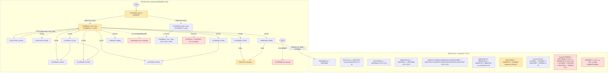

# CardDemo core — Module Inventory (`!mf_module_inventory_analysis`)

Status: analysis complete, presented at **STOP B** (2026-09-07). Analysis only — no code, no plan, no FRs, no stream chosen here.
Module: **CardDemo core** = everything under `app/` except the three optional extension folders (`app/app-authorization-ims-db2-mq`, `app/app-transaction-type-db2`, `app/app-vsam-mq`), which are listed in §1.2 but excluded from the denominator (per orchestrator brief).
Branch: `devin/1788757216-cardemo-account-view-stream`. Source is read-only; every claim cites `path:line`.
Customer-named first stream (not chosen here, only proven): **Account View** — `CAVW` -> `COACTVWC` (map `COACTVW`), hard stop = XCTL back to `COMEN01C`; shared `COSGN00C`, `COMEN01C`, `CSUTLDTC` owned by it.

Generated inputs: `functional/CardDemo/inventory/build_call_graph.py` (script), `inventory/call_graph.md` + `inventory/call_graph.json` (127 program edges, 101 JCL step edges, 18 CSD transactions, 15 Control-M jobs — regenerate with `python3 functional/CardDemo/inventory/build_call_graph.py`).

---

## 1. Module bounding — the denominator

Rule (`.migration/02_conventions.md:30-38`): `CO…C` online, `CB…` batch, `CS…` shared; plus anything they CALL. Mechanical enumeration of `app/cbl/*.cbl|*.CBL` and `app/asm/*.asm` by the script:

**Denominator N = 33 program sources** (31 COBOL + 2 assembler).

| # | Program | Path | Kind (convention) |
|---|---|---|---|
| 1 | CBACT01C | `app/cbl/CBACT01C.cbl` | batch |
| 2 | CBACT02C | `app/cbl/CBACT02C.cbl` | batch |
| 3 | CBACT03C | `app/cbl/CBACT03C.cbl` | batch |
| 4 | CBACT04C | `app/cbl/CBACT04C.cbl` | batch |
| 5 | CBCUS01C | `app/cbl/CBCUS01C.cbl` | batch |
| 6 | CBEXPORT | `app/cbl/CBEXPORT.cbl` | batch |
| 7 | CBIMPORT | `app/cbl/CBIMPORT.cbl` | batch |
| 8 | CBSTM03A | `app/cbl/CBSTM03A.CBL` | batch |
| 9 | CBSTM03B | `app/cbl/CBSTM03B.CBL` | batch subroutine |
| 10 | CBTRN01C | `app/cbl/CBTRN01C.cbl` | batch |
| 11 | CBTRN02C | `app/cbl/CBTRN02C.cbl` | batch |
| 12 | CBTRN03C | `app/cbl/CBTRN03C.cbl` | batch |
| 13 | COACTUPC | `app/cbl/COACTUPC.cbl` | online |
| 14 | COACTVWC | `app/cbl/COACTVWC.cbl` | online |
| 15 | COADM01C | `app/cbl/COADM01C.cbl` | online (admin menu) |
| 16 | COBIL00C | `app/cbl/COBIL00C.cbl` | online |
| 17 | COBSWAIT | `app/cbl/COBSWAIT.cbl` | batch shell (naming exception: `CO` prefix, runs under JCL) |
| 18 | COCRDLIC | `app/cbl/COCRDLIC.cbl` | online |
| 19 | COCRDSLC | `app/cbl/COCRDSLC.cbl` | online |
| 20 | COCRDUPC | `app/cbl/COCRDUPC.cbl` | online |
| 21 | COMEN01C | `app/cbl/COMEN01C.cbl` | online (main menu) |
| 22 | CORPT00C | `app/cbl/CORPT00C.cbl` | online |
| 23 | COSGN00C | `app/cbl/COSGN00C.cbl` | online (sign-on) |
| 24 | COTRN00C | `app/cbl/COTRN00C.cbl` | online |
| 25 | COTRN01C | `app/cbl/COTRN01C.cbl` | online |
| 26 | COTRN02C | `app/cbl/COTRN02C.cbl` | online |
| 27 | COUSR00C | `app/cbl/COUSR00C.cbl` | online |
| 28 | COUSR01C | `app/cbl/COUSR01C.cbl` | online |
| 29 | COUSR02C | `app/cbl/COUSR02C.cbl` | online |
| 30 | COUSR03C | `app/cbl/COUSR03C.cbl` | online |
| 31 | CSUTLDTC | `app/cbl/CSUTLDTC.cbl` | shared utility |
| 32 | COBDATFT | `app/asm/COBDATFT.asm` | assembler (called by CBACT01C `app/cbl/CBACT01C.cbl:231`) |
| 33 | MVSWAIT | `app/asm/MVSWAIT.asm` | assembler (called by COBSWAIT `app/cbl/COBSWAIT.cbl:38`) |

Call targets outside the denominator: LE runtime `CEE3ABD` (10 batch programs, e.g. `app/cbl/CBACT01C.cbl:410`), `CEEDAYS` (`app/cbl/CSUTLDTC.cbl:116`) — framework runtime, not module programs. CSD program `COCRDSEC` (`app/csd/CARDDEMO.CSD:211`) has **no source** (§8). Menu targets `COPAUS0C`, `COTRTLIC`, `COTRTUPC` are out-of-module extension programs (§1.2).

### 1.2 Out-of-module extensions (listed so nothing is silently dropped; NOT in the denominator)

| Program | Path | Extension | Wired into core by |
|---|---|---|---|
| CBPAUP0C | `app/app-authorization-ims-db2-mq/cbl/CBPAUP0C.cbl` | authorization IMS/DB2/MQ | CA-7 trigger CLOSEFIL -> CBPAUP0J -> POSTTRAN (`app/scheduler/CardDemo.ca7:43,70`) |
| COPAUA0C | `app/app-authorization-ims-db2-mq/cbl/COPAUA0C.cbl` | authorization | — |
| COPAUS0C | `app/app-authorization-ims-db2-mq/cbl/COPAUS0C.cbl` | authorization | main-menu option 11 (`app/cpy/COMEN02Y.cpy:89`, guarded `app/cbl/COMEN01C.cbl:147-152`) |
| COPAUS1C | `app/app-authorization-ims-db2-mq/cbl/COPAUS1C.cbl` | authorization | — |
| COPAUS2C | `app/app-authorization-ims-db2-mq/cbl/COPAUS2C.cbl` | authorization | — |
| DBUNLDGS | `app/app-authorization-ims-db2-mq/cbl/DBUNLDGS.CBL` | authorization | — |
| PAUDBLOD | `app/app-authorization-ims-db2-mq/cbl/PAUDBLOD.CBL` | authorization | — |
| PAUDBUNL | `app/app-authorization-ims-db2-mq/cbl/PAUDBUNL.CBL` | authorization | — |
| COBTUPDT | `app/app-transaction-type-db2/cbl/COBTUPDT.cbl` | tran-type DB2 | Control-M job MNTTRDB2 (`app/scheduler/CardDemo.controlm:27`; no JCL in `app/jcl`) |
| COTRTLIC | `app/app-transaction-type-db2/cbl/COTRTLIC.cbl` | tran-type DB2 | admin option 5 (`app/cpy/COADM02Y.cpy:49`) |
| COTRTUPC | `app/app-transaction-type-db2/cbl/COTRTUPC.cbl` | tran-type DB2 | admin option 6 (`app/cpy/COADM02Y.cpy:53`) |
| COACCT01 | `app/app-vsam-mq/cbl/COACCT01.cbl` | VSAM-MQ | — |
| CODATE01 | `app/app-vsam-mq/cbl/CODATE01.cbl` | VSAM-MQ | — |

---

## 2. Call-graph method

`functional/CardDemo/inventory/build_call_graph.py` scans every denominator source, skipping comment lines (`*`/`/` in col 7) and truncating at col 72, and extracts: `CALL 'lit'`; dynamic `CALL id`; `EXEC CICS XCTL|LINK|START PROGRAM(...)` with the argument resolved through `MOVE 'lit' TO var`, `MOVE var2 TO var` (recursive), `VALUE 'lit'` on the declaration, and option-table copybooks (`PIC X(08) VALUE 'xxxxxxxx'` entries of the copybook that declares the subscripted item); `EXEC CICS RETURN TRANSID`; `EXEC CICS READ/…/DELETE FILE|DATASET`; `EXEC CICS WRITEQ TD`; JCL `EXEC PGM=` / `EXEC PROC=` expanded through `app/proc`; CSD `DEFINE TRANSACTION/PROGRAM/FILE/MAPSET`; Control-M `JOB MEMNAME` + `INCOND`/`OUTCOND`. Output: `inventory/call_graph.md` (every edge with `file:line` and its resolution chain) and `inventory/call_graph.json` (inverted index available via `edges[].to`).

Result: **127 program->program edges, 0 unresolved dynamic edges** (§10.6 explains the one caller-dependent idiom, `XCTL PROGRAM(CDEMO-TO-PROGRAM)`, which resolves to a closed literal set).

---

## 3. Entry points (each proven by a runtime declaration, never by "no callers")

### 3.1 ONLINE — `app/csd/CARDDEMO.CSD` (18 `DEFINE TRANSACTION`, 18 `DEFINE PROGRAM`, 16 `DEFINE MAPSET`, 8 `DEFINE FILE`)

| EP | Trancode | Program | CSD proof | Program source | Map (mapset) | Trigger | Runtime def. risk |
|---|---|---|---|---|---|---|---|
| E-01 | CC00 | COSGN00C | `app/csd/CARDDEMO.CSD:378` | present | COSGN00 | terminal sign-on; root of all online | none |
| E-02 | CM00 | COMEN01C | `CARDDEMO.CSD:399` | present | COMEN01 | XCTL from COSGN00C (`app/cbl/COSGN00C.cbl:236`); RETURN TRANSID (`COMEN01C.cbl:107`) | none |
| E-03 | CA00 | COADM01C | `CARDDEMO.CSD:327` | present | COADM01 | XCTL from COSGN00C (`COSGN00C.cbl:231`) | none |
| E-04 | **CAVW** | **COACTVWC** | `CARDDEMO.CSD:317` | present | COACTVW | menu opt 1 (`app/cpy/COMEN02Y.cpy:28`) | none |
| E-05 | CAUP | COACTUPC | `CARDDEMO.CSD:306` | present | COACTUP | menu opt 2 (`COMEN02Y.cpy:34`) | none |
| E-06 | CCLI | COCRDLIC | `CARDDEMO.CSD:357` | present | CCRDLI | menu opt 3 (`COMEN02Y.cpy:40`) | none |
| E-07 | CCDL | COCRDSLC | `CARDDEMO.CSD:347` | present | CCRDSL | menu opt 4 (`:46`); XCTL from COCRDLIC (`app/cbl/COCRDLIC.cbl:526-539`) | none |
| E-08 | CCUP | COCRDUPC | `CARDDEMO.CSD:367` | present | CCRDUP | menu opt 5 (`:52`); XCTL from COCRDLIC (`COCRDLIC.cbl:554-567`) | none |
| E-09 | CT00 | COTRN00C | `CARDDEMO.CSD:419` | present | COTRN00 | menu opt 6 (`:58`) | none |
| E-10 | CT01 | COTRN01C | `CARDDEMO.CSD:429` | present | COTRN01 | menu opt 7 (`:64`); XCTL from COTRN00C (`app/cbl/COTRN00C.cbl:188-192`) | none |
| E-11 | CT02 | COTRN02C | `CARDDEMO.CSD:439` | present | COTRN02 | menu opt 8 (`:71`) | none |
| E-12 | CR00 | CORPT00C | `CARDDEMO.CSD:409` | present | CORPT00 | menu opt 9 (`:77`) | none |
| E-13 | CB00 | COBIL00C | `CARDDEMO.CSD:337` | present | COBIL00 | menu opt 10 (`:83`) | none |
| E-14 | CU00 | COUSR00C | `CARDDEMO.CSD:449` | present | COUSR00 | admin opt 1 (`app/cpy/COADM02Y.cpy:29`) | none |
| E-15 | CU01 | COUSR01C | `CARDDEMO.CSD:459` | present | COUSR01 | admin opt 2 (`:34`) | none |
| E-16 | CU02 | COUSR02C | `CARDDEMO.CSD:469` | present | COUSR02 | admin opt 3 (`:39`); XCTL from COUSR00C (`app/cbl/COUSR00C.cbl:192-196`) | none |
| E-17 | CU03 | COUSR03C | `CARDDEMO.CSD:479` | present | COUSR03 | admin opt 4 (`:44`); XCTL from COUSR00C (`COUSR00C.cbl:202-206`) | none |
| E-18 | **CDV1** | **COCRDSEC** | `CARDDEMO.CSD:388` (PROGRAM def `:211`) | **ABSENT** | none in `app/bms` | none found (no XCTL/menu entry references it) | **HIGH — CSD-defined, source absent** |

All 17 present online programs also `EXEC CICS RETURN TRANSID(<own trancode>)` (pseudo-conversational re-entry, e.g. `app/cbl/COACTVWC.cbl:402`) — 20 RETURN sites listed in `inventory/call_graph.md`.

### 3.2 BATCH — JCL `EXEC PGM=` (`app/jcl`, `app/proc`) + scheduler (`app/scheduler/CardDemo.controlm`, `CardDemo.ca7`)

| EP | Job (JCL) | Step -> program | JCL proof | Scheduler proof | Runtime def. risk |
|---|---|---|---|---|---|
| E-19 | WAITSTEP | WAIT -> COBSWAIT (-> MVSWAIT) | `app/jcl/WAITSTEP.jcl:22` | Control-M DAILY/WEEKLY/MONTHLY (`CardDemo.controlm:14,44,81`); CA-7 (`CardDemo.ca7:97,189,…`) | none |
| E-20 | INTCALC | STEP15 -> CBACT04C | `app/jcl/INTCALC.jcl:22` | Control-M MONTHLY-InterestCalculation (`controlm:69`, INCOND CLOSEFIL) | none |
| E-21 | POSTTRAN | STEP15 -> CBTRN02C | `app/jcl/POSTTRAN.jcl:23` | **CA-7 only**: triggered by CBPAUP0J (`CardDemo.ca7:70`), which is triggered by CLOSEFIL (`:43`); NOT in Control-M | MEDIUM — upstream CBPAUP0J is out-of-module |
| E-22 | TRANREPT | STEP10R -> CBTRN03C (STEP05R REPROC->IDCAMS, SORT) | `app/jcl/TRANREPT.jcl:59` (`:23` PROC REPROC -> `app/proc/REPROC.prc:21`) | none in scheduler; submitted online by CORPT00C via TDQ `JOBS` with `EXEC PROC=TRANREPT` (`app/cbl/CORPT00C.cbl:93,517-518`; `app/proc/TRANREPT.prc`) | none (online-triggered) |
| E-23 | CREASTMT | STEP040 -> CBSTM03A (calls CBSTM03B) | `app/jcl/CREASTMT.JCL:79`; `app/cbl/CBSTM03A.CBL:351` | CA-7: CLOSEFIL -> CREASTMT -> TXT2PDF1 (`CardDemo.ca7:468,495`) | none |
| E-24 | READACCT | STEP05 -> CBACT01C (calls COBDATFT) | `app/jcl/READACCT.jcl:32`; `app/cbl/CBACT01C.cbl:231` | CA-7 chain CLOSEFIL -> READACCT -> READCARD -> READCUST -> READXREF (`CardDemo.ca7:340,367,394,421`) | none |
| E-25 | READCARD | STEP05 -> CBACT02C | `app/jcl/READCARD.jcl:22` | CA-7 (same chain) | none |
| E-26 | READCUST | STEP05 -> CBCUS01C | `app/jcl/READCUST.jcl:21` | CA-7 (same chain) | none |
| E-27 | READXREF | STEP05 -> CBACT03C | `app/jcl/READXREF.jcl:22` | CA-7 (`CardDemo.ca7:421`) | none |
| E-28 | CBEXPORT | STEP02 -> CBEXPORT | `app/jcl/CBEXPORT.jcl:43` | none (ad-hoc JCL only) | LOW — no scheduler definition |
| E-29 | CBIMPORT | STEP01 -> CBIMPORT | `app/jcl/CBIMPORT.jcl:22` | none (ad-hoc JCL only) | LOW — no scheduler definition |
| E-30 | MNTTRDB2 | (JCL absent) | — | Control-M WEEKLY-TransactionTypesDBRefresh (`controlm:27`) | **HIGH — scheduled, no JCL in `app/jcl`; belongs to DB2 extension** |
| E-31 | TRANEXTR | (JCL absent) | — | Control-M (`controlm:58`, INCOND MNTTRDB2) | **HIGH — scheduled, no JCL** |

Utility-only jobs (no module COBOL: IDCAMS/SORT/IEFBR14/IEBGENER/SDSF/IKJEFT1B/FTP/DFHCSDUP): CLOSEFIL, OPENFIL, TRANBKP, DISCGRP, COMBTRAN, TXT2PDF1, PRTCATBL, TRANTYPE, TRANCATG, TCATBALF, ACCTFILE, CARDFILE, CUSTFILE, XREFFILE, TRANFILE, TRANIDX, REPTFILE, DALYREJS, DEFCUST, DEFGDGB, DEFGDGD, DUSRSECJ, ESDSRRDS, FTPJCL, INTRDRJ1, INTRDRJ2, CBADMCDJ (full list with cites in `inventory/call_graph.md` §"JCL step -> program").

### 3.3 SUBTRANSACTION
None with its own trancode invoked by another module. Internal sub-flows: `CBSTM03B` (CALLed by CBSTM03A, 13 call sites `app/cbl/CBSTM03A.CBL:351-909`), `CSUTLDTC` (CALLed by COTRN02C `app/cbl/COTRN02C.cbl:393,413` and CORPT00C `app/cbl/CORPT00C.cbl:392,412`), assembler `MVSWAIT`, `COBDATFT`.

### 3.4 ORPHAN roots
**CBTRN01C** (`app/cbl/CBTRN01C.cbl`): no CSD entry, no `EXEC PGM=CBTRN01C` in `app/jcl`/`app/proc`, no scheduler MEMNAME, no CALL/XCTL from any program (script finding `orphan_roots_no_csd_no_jcl_no_caller`; `grep -rn CBTRN01C app/jcl app/proc app/scheduler` = 0 hits). Classified **UNREACHABLE**, not promoted to an entry point. Its file set (DALYTRAN, CUSTOMER, XREF, CARD, ACCOUNT, TRANSACT — `CBTRN01C.cbl` SELECTs) overlaps CBTRN02C, suggesting a superseded predecessor.

---

## 4. Route closure (producer–consumer proof)

### 4.1 Main menu — reception `COMEN01C`, table `app/cpy/COMEN02Y.cpy`

**Producer.** Screen field `OPTIONI` is right-justified, blanks -> '0', moved to `WS-OPTION PIC 9(02)` (`app/cbl/COMEN01C.cbl:122-124`). Declared domain: `CDEMO-MENU-OPT-COUNT VALUE 11` (`COMEN02Y.cpy:21`); table `OCCURS 12 TIMES` (`COMEN02Y.cpy:94`) — slot 12 is declared but has no data entry and is unreachable because of the `> CDEMO-MENU-OPT-COUNT` guard (no off-by-one risk; slack slot documented).

**Consumers (every producible value):**

| Producible value | Branch | Cite | Route |
|---|---|---|---|
| non-numeric, 0, >11 | "Please enter a valid option number..." | `COMEN01C.cbl:127-134` | default/error route (documented) |
| any 1..11 where `CDEMO-MENU-OPT-USRTYPE = 'A'` and user is `U` | "No access - Admin Only option..." | `COMEN01C.cbl:136-143` | access pre-check; **currently unreachable** — all 11 entries have USRTYPE `U` (`COMEN02Y.cpy:29,35,41,47,53,59,65,72,78,84,90`); comment at `:69` shows opt 8 was once Admin Only |
| 11 (`COPAUS0C`) | `EXEC CICS INQUIRE PROGRAM` -> XCTL if installed else "not installed..." | `COMEN01C.cbl:147-167` | S-13 blocked route (out-of-module) |
| any whose PGMNAME(1:5)='DUMMY' | "is coming soon ..." | `COMEN01C.cbl:169-176` | placeholder route; **no DUMMY entry exists today** (0 hits in `COMEN02Y.cpy`) |
| 1..10 | `WHEN OTHER` -> `XCTL PROGRAM(CDEMO-MENU-OPT-PGMNAME(WS-OPTION))` | `COMEN01C.cbl:177-188` | S-01..S-10 |
| AID = PF3 | XCTL `COSGN00C` | `COMEN01C.cbl:199-201` | exit route |
| AID other than ENTER/PF3 | invalid-key message | `COMEN01C.cbl:99-102` (EVALUATE EIBAID `WHEN OTHER`) | default route |

Table entries 1..11 -> COACTVWC, COACTUPC, COCRDLIC, COCRDSLC, COCRDUPC, COTRN00C, COTRN01C, COTRN02C, CORPT00C, COBIL00C, COPAUS0C (`COMEN02Y.cpy:28,34,40,46,52,58,64,71,77,83,89`). **11 producible values = 11 table entries = 10 in-module XCTL targets + 1 guarded out-of-module target; plus 4 documented default/blocked paths. CLOSED.**

**Grep sweep of `WS-OPTION` in COMEN01C** (all hits): `:45-46` declaration, `:122-125` producer, `:127-129` range check, `:137` access pre-check, `:147,149,157,164,169,173,185` the single main dispatch. `CDEMO-MENU-OPT-PGMNAME` appears nowhere else in `app/cbl` (script: only COMEN01C edges reference it). No hidden second router.

### 4.2 Admin menu — reception `COADM01C`, table `app/cpy/COADM02Y.cpy`

Producer identical (`COADM01C.cbl:126-128`). Domain `CDEMO-ADMIN-OPT-COUNT VALUE 6` (`COADM02Y.cpy:22`); table `OCCURS 9 TIMES` (`:56`) — slots 7..9 slack, guarded by `> CDEMO-ADMIN-OPT-COUNT` (`COADM01C.cbl:131-133`).

| Producible value | Branch | Cite | Route |
|---|---|---|---|
| non-numeric, 0, >6 | error message | `COADM01C.cbl:131-138` | default route |
| 1..6 with PGMNAME(1:5) != 'DUMMY' | `XCTL PROGRAM(CDEMO-ADMIN-OPT-PGMNAME(WS-OPTION))` | `COADM01C.cbl:141-148` | 1..4 -> COUSR00C..COUSR03C (S-11); 5,6 -> COTRTLIC/COTRTUPC (S-14, out-of-module) |
| DUMMY entry | falls through to "is not installed ..." | `COADM01C.cbl:149-156` | placeholder route; no DUMMY entry today |
| PF3 | XCTL `COSGN00C` | `COADM01C.cbl:166-168` | exit |

**6 = 6. CLOSED.** Grep sweep `WS-OPTION` in COADM01C: `:45-46, 126-129, 131-133, 141, 146` — single dispatch. No admin-only pre-check exists in COADM01C (all admin routes assume admin user; COSGN00C only routes `CDEMO-USRTYP-ADMIN` here, `app/cbl/COSGN00C.cbl:230-233`).

### 4.3 Sign-on dispatch — `COSGN00C`
`READ FILE('USRSEC')` (`COSGN00C.cbl:211`); on password match: `CDEMO-USRTYP-ADMIN` -> XCTL `'COADM01C'` (`:230-234`) else XCTL `'COMEN01C'` (`:235-239`); mismatch/not-found -> error re-display (`:128`, `:252`); PF3 -> exit (`:88`). Domain of `SEC-USR-TYPE` is `A`/`U` (`app/cpy/COCOM01Y.cpy:27-28`); both consumed. CLOSED.

### 4.4 Return routing idiom (all screen programs)
Every screen program returns with `XCTL PROGRAM(CDEMO-TO-PROGRAM)` where `CDEMO-TO-PROGRAM` is fed only by `LIT-MENUPGM` (`'COMEN01C'`) or by `CDEMO-FROM-PROGRAM` (the caller stamped in COMMAREA) — e.g. `app/cbl/COACTVWC.cbl:333-352`. Producers of `CDEMO-FROM-PROGRAM` are the XCTL sites in §2 (COMEN01C, COADM01C, COCRDLIC, COTRN00C, COUSR00C, each screen's own `LIT-THISPGM`), so the value set is closed to module programs. The script resolves these to concrete edges (`inventory/call_graph.md` rows marked `XCTL(dyn)`).

---

## 5. Stream catalog

| ID | Stream (short name) | Type | Entry (§3) | Programs (in-module) | Screens / job steps | Status |
|---|---|---|---|---|---|---|
| **S-01** | **AccountView** (customer-named first stream) | **ONLINE** (proposed) | E-04 CAVW via menu opt 1 | COACTVWC; owns shared COSGN00C, COMEN01C, CSUTLDTC | 1 map COACTVW (`app/bms/COACTVW.bms`) + sign-on + menu | active |
| S-02 | AccountUpdate | ONLINE | E-05 CAUP / opt 2 | COACTUPC | COACTUP | active |
| S-03 | CardList | ONLINE | E-06 CCLI / opt 3 | COCRDLIC (XCTLs to S-04/S-05) | CCRDLI | active |
| S-04 | CardView | ONLINE | E-07 CCDL / opt 4 | COCRDSLC | CCRDSL | active |
| S-05 | CardUpdate | ONLINE | E-08 CCUP / opt 5 | COCRDUPC | CCRDUP | active |
| S-06 | TranList | ONLINE | E-09 CT00 / opt 6 | COTRN00C (XCTLs to S-07) | COTRN00 | active |
| S-07 | TranView | ONLINE | E-10 CT01 / opt 7 | COTRN01C | COTRN01 | active |
| S-08 | TranAdd | ONLINE | E-11 CT02 / opt 8 | COTRN02C (+shared CSUTLDTC) | COTRN02 | active |
| S-09 | TranReports | ONLINE->BATCH | E-12 CR00 / opt 9 + E-22 TRANREPT | CORPT00C, CBTRN03C (+shared CSUTLDTC) | CORPT00 + 3 steps (`TRANREPT.jcl:23,37,59`) | active; crosses B-0018 |
| S-10 | BillPay | ONLINE | E-13 CB00 / opt 10 | COBIL00C | COBIL00 | active |
| S-11 | UserAdmin | ONLINE | E-03 CA00 + E-14..E-17 / admin opts 1-4 | COADM01C, COUSR00C, COUSR01C, COUSR02C, COUSR03C | COADM01, COUSR00-03 | active (admin users only) |
| S-12 | CardSecurity (CDV1) | ONLINE | E-18 | COCRDSEC — **source absent** | none | **BLOCKED / absent module** |
| S-13 | PendingAuthView (menu opt 11) | ONLINE | menu opt 11 -> COPAUS0C | none in module (target in `app/app-authorization-ims-db2-mq`) | — | **BLOCKED / out-of-module**, runtime-guarded (`COMEN01C.cbl:147-152`) |
| S-14 | TranTypeMaint (admin opts 5-6) | ONLINE | admin opts 5,6 -> COTRTLIC/COTRTUPC | none in module (targets in `app/app-transaction-type-db2`) | — | **BLOCKED / out-of-module**, no runtime guard (XCTL would fail if not installed) |
| S-15 | DailyTranBackup | BATCH | Control-M DAILY-TransactionBackup | COBSWAIT (shared) | CLOSEFIL -> TRANBKP -> WAITSTEP -> OPENFIL (`controlm:4-24`) | active (utility chain) |
| S-16 | MonthlyInterest | BATCH | E-20 Control-M MONTHLY-InterestCalculation | CBACT04C (+shared COBSWAIT) | CLOSEFIL -> INTCALC -> COMBTRAN -> WAITSTEP -> OPENFIL (`controlm:65-91`) | active |
| S-17 | WeeklyDiscGrpRefresh | BATCH | Control-M WEEKLY-DisclosureGroupsRefresh | (utility only, shared COBSWAIT) | CLOSEFIL -> DISCGRP -> WAITSTEP -> OPENFIL (`controlm:33-54`); INCOND on MNTTRDB2 | active but **depends on S-18 (blocked)** |
| S-18 | WeeklyTranTypeDB2 | BATCH | E-30/E-31 Control-M WEEKLY-TransactionTypesDBRefresh | none (MNTTRDB2/TRANEXTR JCL absent) | MNTTRDB2 -> TRANEXTR (`controlm:27-62`) | **BLOCKED / JCL absent, DB2 extension** |
| S-19 | DailyPosting | BATCH | E-21 POSTTRAN (CA-7) | CBTRN02C | CLOSEFIL -> CBPAUP0J -> POSTTRAN -> WAITSTEP -> OPENFIL (`ca7:43,70,97,124`) | active; upstream CBPAUP0J out-of-module |
| S-20 | Statements | BATCH | E-23 CREASTMT (CA-7) | CBSTM03A, CBSTM03B | 5 steps incl. SORT, IDCAMS (`CREASTMT.JCL:44-96`); -> TXT2PDF1 | active |
| S-21 | DataVerifyReads | BATCH | E-24..E-27 (CA-7) | CBACT01C, CBACT02C, CBCUS01C, CBACT03C, COBDATFT | 4 jobs, 1 step each | active |
| S-22 | BranchExportImport | BATCH | E-28, E-29 (JCL only) | CBEXPORT, CBIMPORT | 2 + 1 steps | active, unscheduled |
| S-23 | RefDataRefresh | BATCH | CA-7 TRANTYPE / TRANCATG / TCATBALF / PRTCATBL chains (`ca7:162,244,271,537`) | none (IDCAMS/SORT only) | utility steps | active (utility chain) |
| — | Unreachable | — | none | CBTRN01C | — | **DEAD / orphan root** |

Active: S-01..S-11, S-15..S-17, S-19..S-23 (19). Blocked: S-12 (absent source), S-13, S-14 (out-of-module targets), S-18 (JCL absent). Dead: CBTRN01C.

---

## 6. Program-level coverage (the 100% gate)

```
33 programs = 27 stream-assigned (exactly one stream each)
            +  5 shared/utility  (COSGN00C, COMEN01C, CSUTLDTC, COBSWAIT, MVSWAIT)
            +  1 unreachable     (CBTRN01C)
            = 33   BALANCES
```

| Program | Bucket | Stream(s) | Cite |
|---|---|---|---|
| COACTVWC | stream | S-01 | `CARDDEMO.CSD:317`; `COMEN02Y.cpy:28` |
| COACTUPC | stream | S-02 | `CARDDEMO.CSD:306`; `COMEN02Y.cpy:34` |
| COCRDLIC | stream | S-03 | `CARDDEMO.CSD:357`; `COMEN02Y.cpy:40` |
| COCRDSLC | stream | S-04 | `CARDDEMO.CSD:347`; `COMEN02Y.cpy:46` |
| COCRDUPC | stream | S-05 | `CARDDEMO.CSD:367`; `COMEN02Y.cpy:52` |
| COTRN00C | stream | S-06 | `CARDDEMO.CSD:419`; `COMEN02Y.cpy:58` |
| COTRN01C | stream | S-07 | `CARDDEMO.CSD:429`; `COMEN02Y.cpy:64` |
| COTRN02C | stream | S-08 | `CARDDEMO.CSD:439`; `COMEN02Y.cpy:71` |
| CORPT00C | stream | S-09 | `CARDDEMO.CSD:409`; `COMEN02Y.cpy:77` |
| CBTRN03C | stream | S-09 | `TRANREPT.jcl:59`; submitted by `CORPT00C.cbl:517` |
| COBIL00C | stream | S-10 | `CARDDEMO.CSD:337`; `COMEN02Y.cpy:83` |
| COADM01C | stream | S-11 | `CARDDEMO.CSD:327`; `COSGN00C.cbl:231` |
| COUSR00C | stream | S-11 | `CARDDEMO.CSD:449`; `COADM02Y.cpy:29` |
| COUSR01C | stream | S-11 | `CARDDEMO.CSD:459`; `COADM02Y.cpy:34` |
| COUSR02C | stream | S-11 | `CARDDEMO.CSD:469`; `COADM02Y.cpy:39` |
| COUSR03C | stream | S-11 | `CARDDEMO.CSD:479`; `COADM02Y.cpy:44` |
| CBACT04C | stream | S-16 | `INTCALC.jcl:22`; `controlm:69` |
| CBTRN02C | stream | S-19 | `POSTTRAN.jcl:23`; `ca7:70` |
| CBSTM03A | stream | S-20 | `CREASTMT.JCL:79`; `ca7:468` |
| CBSTM03B | stream | S-20 | `CBSTM03A.CBL:351` |
| CBACT01C | stream | S-21 | `READACCT.jcl:32` |
| COBDATFT | stream | S-21 | `CBACT01C.cbl:231`; `app/asm/COBDATFT.asm` |
| CBACT02C | stream | S-21 | `READCARD.jcl:22` |
| CBCUS01C | stream | S-21 | `READCUST.jcl:21` |
| CBACT03C | stream | S-21 | `READXREF.jcl:22` |
| CBEXPORT | stream | S-22 | `CBEXPORT.jcl:43` |
| CBIMPORT | stream | S-22 | `CBIMPORT.jcl:22` |
| COSGN00C | shared | all online (S-01..S-14) | `CARDDEMO.CSD:378`; XCTL targets `COSGN00C.cbl:231,236` |
| COMEN01C | shared | S-01..S-10, S-13 | `CARDDEMO.CSD:399`; dispatch `COMEN01C.cbl:185` |
| CSUTLDTC | shared | S-08, S-09 | `COTRN02C.cbl:393,413`; `CORPT00C.cbl:392,412` |
| COBSWAIT | shared | S-15, S-16, S-17 (+ CA-7 chains S-19..S-21, S-23) | `WAITSTEP.jcl:22`; `controlm:14,44,81` |
| MVSWAIT | shared | via COBSWAIT | `COBSWAIT.cbl:38`; `app/asm/MVSWAIT.asm` |
| CBTRN01C | unreachable | — | no CSD/JCL/scheduler/caller (§3.4) |

Not in the denominator but tracked: COCRDSEC (CSD only, S-12), COPAUS0C / COTRTLIC / COTRTUPC / COBTUPDT / CBPAUP0C (extensions, §1.2).

Note on ownership: the customer assigned `CSUTLDTC` to Account View. Source evidence shows `COACTVWC` does **not** call `CSUTLDTC` (0 hits in `app/cbl/COACTVWC.cbl`; its date handling is via copybooks `CSUTLDPY`/`CSUTLDWY`); actual callers are S-08 and S-09. Ownership is recorded as stated by the customer; this is flagged for confirmation at STOP B, not changed.

---

## 7. Shared-program (choke point) map

| Program | Executed by streams | R/W | Call-in contract | Owner (port once) |
|---|---|---|---|---|
| COSGN00C | every online stream (entry of all sessions) | reads USRSEC (`COSGN00C.cbl:211`); sets COMMAREA user/type | terminal CC00; XCTL out with `CARDDEMO-COMMAREA` (`COCOM01Y.cpy`) | **S-01 AccountView** (customer decision) |
| COMEN01C | S-01..S-10, S-13 (dispatch) and every screen's return XCTL | read-only (no file I/O besides COMMAREA) | XCTL in from COSGN00C / any screen with COMMAREA; XCTL out by option table | **S-01 AccountView** |
| CSUTLDTC | S-08 (`COTRN02C.cbl:393,413`), S-09 (`CORPT00C.cbl:392,412`) | read-only pure function; calls LE `CEEDAYS` (`CSUTLDTC.cbl:116`) | `CALL 'CSUTLDTC' USING date X(10), format X(10), result` (`CORPT00C.cbl:129-136`) | **S-01 AccountView** (customer decision; see §6 note) |
| COBSWAIT (+MVSWAIT) | S-15, S-16, S-17 via Control-M; S-19, S-20, S-21, S-23 via CA-7 | none (timer) | JCL `PARM` centiseconds (`WAITSTEP.jcl:20-22`) | first batch stream migrated; likely replaced by scheduler-native wait (decision deferred) |
| COADM01C | S-11 only (and S-14 blocked) | read-only | XCTL from COSGN00C | S-11 |
| COCOM01Y COMMAREA copybook | all online | data contract | `CARDDEMO-COMMAREA` | ported once with S-01 |

---

## 8. Boundary register — first pass (appended to `.migration/04_boundary_register.md`, IDs B-0001..B-0027, State `OPEN` = undecided/classify-only)

| Id | Kind | Legacy side | Other side | Streams |
|---|---|---|---|---|
| B-0001 | DATASET | ACCTDAT VSAM KSDS (`CARDDEMO.CSD:1-2`) | S-01/02/10 online read, S-02/10 REWRITE; batch S-16/19/20/21/22 | many |
| B-0002 | DATASET | CUSTDAT (`CSD:50-52`) | S-01/02 read, S-02 REWRITE; batch S-20/21/22 | many |
| B-0003 | DATASET | CARDDAT (`CSD:25-26`) | S-03/04/05; batch S-21/22 | many |
| B-0004 | DATASET | CCXREF (`CSD:37-39`) | S-08 read; batch S-16/19/20/21/22 | many |
| B-0005 | DATASET | TRANSACT (`CSD:76-77`) | S-06/07 read, S-08/10 WRITE; batch S-09/15/16/19/20/22 | many |
| B-0006 | DATASET | USRSEC (`CSD:88-89`) | S-01 sign-on read (`COSGN00C.cbl:211`); S-11 CRUD | S-01, S-11 |
| B-0007 | DATASET | CXACAIX AIX path over CCXREF (`CSD:63-65`) | S-01 (`COACTVWC.cbl:727`), S-02, S-08, S-10; INTCALC (`INTCALC.jcl:32`) | S-01… |
| B-0008 | DATASET | CARDAIX AIX path over CARDDAT (`CSD:13-14`) | S-04, S-05 | S-04, S-05 |
| B-0009 | PROGRAM | CICS XCTL COSGN00C -> COMEN01C / COADM01C (`COSGN00C.cbl:231,236`) | shell -> menus | all online |
| B-0010 | PROGRAM | menu dispatch XCTL + return XCTL `CDEMO-TO-PROGRAM` (`COMEN01C.cbl:185`; `COACTVWC.cbl:349`) | S-01 hard stop <-> S-02..S-10 | all online |
| B-0011 | PROGRAM | COMEN01C opt 11 -> COPAUS0C (`COMEN01C.cbl:147-158`) | authorization extension (out of module) | S-13 |
| B-0012 | PROGRAM | COADM01C opts 5,6 -> COTRTLIC/COTRTUPC (`COADM01C.cbl:146`; `COADM02Y.cpy:49,53`) | tran-type DB2 extension | S-14 |
| B-0013 | PROGRAM | CDV1 -> COCRDSEC (`CARDDEMO.CSD:211,388`) | absent module | S-12 |
| B-0014 | SHARED-UTIL | CSUTLDTC CALL (`COTRN02C.cbl:393`; `CORPT00C.cbl:392`) | S-01 owner | S-08, S-09 |
| B-0015 | EXTERNAL | LE services CEEDAYS (`CSUTLDTC.cbl:116`), CEE3ABD (10 batch pgms) | z/OS Language Environment | S-08/09 + batch |
| B-0016 | SHARED-UTIL | COBSWAIT -> MVSWAIT asm (`COBSWAIT.cbl:38`; `WAITSTEP.jcl:22`) | assembler | batch chains |
| B-0017 | EXTERNAL | COBDATFT asm (`CBACT01C.cbl:231`; `app/asm/COBDATFT.asm`) | assembler | S-21 |
| B-0018 | EXTERNAL | CORPT00C WRITEQ TD `JOBS` -> INTRDR `EXEC PROC=TRANREPT` (`CORPT00C.cbl:93,517-518`) | JES / batch S-09 | S-09 |
| B-0019 | SCHEDULER | Control-M DAILY INCOND/OUTCOND (`controlm:4-24`) | Control-M | S-15 |
| B-0020 | SCHEDULER | Control-M MONTHLY (`controlm:65-91`) | Control-M | S-16 |
| B-0021 | SCHEDULER | Control-M WEEKLY MNTTRDB2/TRANEXTR (JCL absent) + DISCGRP INCOND (`controlm:27-62`) | Control-M / DB2 extension | S-17, S-18 |
| B-0022 | SCHEDULER | CA-7 triggers incl. CBPAUP0J -> POSTTRAN (`ca7:43,70`), READ* chain, CREASTMT -> TXT2PDF1 | CA-7 / authorization extension | S-19..S-21, S-23 |
| B-0023 | DATASET | batch PS/GDG hand-offs: DALYTRAN.PS, DALYREJS(+1), SYSTRAN(+1), TRANSACT.BKUP/DALY(+1), TRANREPT(+1), STATEMNT.PS/HTML, TRXFL, EXPORT.DATA, *.IMPORT (`POSTTRAN.jcl:31,38`; `INTCALC.jcl:41`; `TRANREPT.jcl:33,55,80`; `CREASTMT.JCL:48-96`; `CBEXPORT.jcl:63`; `CBIMPORT.jcl:29-57`) | upstream feeds / downstream consumers | S-09, S-16, S-19, S-20, S-22 |
| B-0024 | DATASET | batch-only VSAM: TCATBALF, DISCGRP, TRANTYPE, TRANCATG (`POSTTRAN.jcl:42`; `INTCALC.jcl:28,36`; `TRANREPT.jcl:70,72`) | S-23 ref-data jobs | S-09, S-16, S-19, S-23 |
| B-0025 | EXTERNAL | TXT2PDF1 IKJEFT1B + external load lib (`TXT2PDF1.JCL:24`); FTPJCL (`FTPJCL.JCL:30`) | external tools | S-20 |
| B-0026 | EXTERNAL | sign-on authentication via USRSEC record (RACF substitute) (`COSGN00C.cbl:211-236`) | target IdP / auth | S-01 |
| B-0027 | DATA-TARGET | COMMAREA contract `COCOM01Y.cpy` shared by all online programs | target session/state model | all online |

**Count by class: DATASET 10 · PROGRAM 5 · SHARED-UTIL 2 · EXTERNAL 5 · SCHEDULER 4 · DATA-TARGET 1 = 27.** No integration approach decided (register schema has no `UNDECIDED` state; `OPEN` used with note "classify only").

---

## 9. Risk list

1. **HIGH — COCRDSEC absent**: CSD program + CDV1 transaction defined (`CARDDEMO.CSD:211,388`), no source, no BMS map, no caller. S-12 cannot be migrated or descoped without customer input.
2. **HIGH — Control-M jobs without JCL**: MNTTRDB2, TRANEXTR (`controlm:27,58`). S-17 DISCGRP refresh has an INCOND on MNTTRDB2 (`controlm:35`), so S-17 is scheduler-blocked by an extension job.
3. **MEDIUM — orphan root CBTRN01C**: no runtime declaration; confirm dead before descoping.
4. **MEDIUM — out-of-module menu routes**: opt 11 (runtime-guarded), admin opts 5/6 (unguarded XCTL). Behaviour when targets are absent must be specified for S-11/S-13/S-14.
5. **MEDIUM — POSTTRAN scheduled only via CA-7 behind CBPAUP0J** (extension job); Control-M DAILY does not include POSTTRAN. Which scheduler is authoritative is a customer question.
6. **MEDIUM — assembler dependencies** MVSWAIT, COBDATFT (`app/asm`) need functional re-spec.
7. **MEDIUM — online->batch hand-off** CORPT00C INTRDR submit (B-0018) needs a target-side job trigger.
8. **LOW — unresolved dynamic edges: none.** `CDEMO-TO-PROGRAM`/`CCARD-NEXT-PROG` resolve to closed literal sets (§4.4, `inventory/call_graph.md`).
9. **LOW — CSUTLDTC ownership** assigned to S-01 although S-01 does not call it (§6 note).
10. **LOW — dead access pre-check**: admin-only guard in COMEN01C (`:136-143`) is unreachable with the current table; documented, keep behaviour.

---

## 10. Module flow diagram



Source (`diagrams/CardDemo_module_flow.mmd`):

```mermaid
flowchart TB
  subgraph ONLINE["ONLINE (CICS, app/csd/CARDDEMO.CSD)"]
    CC00(["CC00"]) --> COSGN00C["COSGN00C sign-on (USRSEC)"]
    COSGN00C -- "USRTYP=U XCTL" --> COMEN01C["COMEN01C main menu (COMEN02Y: 11 opts)"]
    COSGN00C -- "USRTYP=A XCTL" --> COADM01C["COADM01C admin menu (COADM02Y: 6 opts)"]
    COMEN01C -- "1  S-01 AccountView" --> COACTVWC["COACTVWC (CAVW)"]
    COMEN01C -- "2  S-02" --> COACTUPC["COACTUPC (CAUP)"]
    COMEN01C -- "3  S-03" --> COCRDLIC["COCRDLIC (CCLI)"]
    COMEN01C -- "4  S-04" --> COCRDSLC["COCRDSLC (CCDL)"]
    COMEN01C -- "5  S-05" --> COCRDUPC["COCRDUPC (CCUP)"]
    COMEN01C -- "6  S-06" --> COTRN00C["COTRN00C (CT00)"]
    COMEN01C -- "7  S-07" --> COTRN01C["COTRN01C (CT01)"]
    COMEN01C -- "8  S-08" --> COTRN02C["COTRN02C (CT02)"]
    COMEN01C -- "9  S-09" --> CORPT00C["CORPT00C (CR00)"]
    COMEN01C -- "10 S-10" --> COBIL00C["COBIL00C (CB00)"]
    COMEN01C -. "11 S-13 INQUIRE guard" .-> COPAUS0C["COPAUS0C (out of module)"]
    COACTVWC -- "hard stop: XCTL back" --> COMEN01C
    COCRDLIC --> COCRDSLC
    COCRDLIC --> COCRDUPC
    COTRN00C --> COTRN01C
    COTRN02C -- CALL --> CSUTLDTC["CSUTLDTC (shared)"]
    CORPT00C -- CALL --> CSUTLDTC
    COADM01C -- "1..4 S-11" --> COUSR["COUSR00C / 01C / 02C / 03C (CU00..CU03)"]
    COADM01C -. "5,6 S-14" .-> COTRT["COTRTLIC / COTRTUPC (out of module)"]
    CDV1(["CDV1"]) -. "S-12 ABSENT" .-> COCRDSEC["COCRDSEC (no source)"]
  end
  CORPT00C -- "WRITEQ TD JOBS (INTRDR)" --> TRANREPT
  subgraph BATCH["BATCH (JCL + Control-M + CA-7)"]
    TRANREPT["TRANREPT.jcl -> CBTRN03C"]
    INTCALC["INTCALC.jcl -> CBACT04C (Control-M MONTHLY) S-16"]
    POSTTRAN["POSTTRAN.jcl -> CBTRN02C (CA-7) S-19"]
    CREASTMT["CREASTMT.JCL -> CBSTM03A -> CBSTM03B (CA-7) S-20"]
    READS["READACCT/READCARD/READCUST/READXREF -> CBACT01C(+COBDATFT)/CBACT02C/CBCUS01C/CBACT03C (CA-7) S-21"]
    EXPIMP["CBEXPORT.jcl / CBIMPORT.jcl -> CBEXPORT / CBIMPORT (no scheduler) S-22"]
    WAITSTEP["WAITSTEP.jcl -> COBSWAIT -> MVSWAIT (shared) S-15/16/17"]
    DAILY["Control-M DAILY: CLOSEFIL -> TRANBKP -> WAITSTEP -> OPENFIL S-15"]
    WEEKLY["Control-M WEEKLY: MNTTRDB2 (no JCL) -> TRANEXTR (no JCL) S-18; -> CLOSEFIL -> DISCGRP -> WAITSTEP -> OPENFIL S-17"]
    ORPHAN["CBTRN01C: no JCL, no CSD, no caller (UNREACHABLE)"]
  end
  classDef blocked fill:#fdd,stroke:#c00
  classDef shared fill:#ffe9b3,stroke:#b80
  class COPAUS0C,COTRT,COCRDSEC,ORPHAN,WEEKLY blocked
  class COSGN00C,COMEN01C,CSUTLDTC,WAITSTEP shared
```



---

## 11. Stream sizing and recommended module-wide order (recommendation; customer chooses)

| Order | Stream | Programs (own / shared) | Screens or steps | Boundaries | Notes |
|---|---|---|---|---|---|
| 1 | **S-01 AccountView** (customer-named) | 1 / 3 owned (COSGN00C, COMEN01C, CSUTLDTC) | 3 maps | B-0001/02/06/07/09/10/14/26/27 | builds sign-on, menu shell, COMMAREA seam, account/customer read seam |
| 2 | S-04 CardView, S-06 TranList, S-07 TranView | 1 each | 1 map each | CARDDAT/CARDAIX, TRANSACT read | read-only; extend data seams |
| 3 | S-03 CardList | 1 | 1 | XCTL to S-04/S-05 | dispatching list |
| 4 | S-08 TranAdd (first real CSUTLDTC consumer), S-02 AccountUpdate, S-05 CardUpdate, S-10 BillPay | 1 each | 1 each | REWRITE/WRITE on ACCTDAT/CUSTDAT/CARDDAT/TRANSACT | state-changing |
| 5 | S-11 UserAdmin | 5 | 5 maps | USRSEC CRUD | admin shell |
| 6 | S-19 DailyPosting, S-16 MonthlyInterest (ports COBSWAIT seam), S-15 DailyTranBackup | 1 / 1 | chains | B-0019/20/22/23/24 | batch after online writes exist |
| 7 | S-09 TranReports | 2 | 1 map + 3 steps | B-0018 | needs online->batch trigger |
| 8 | S-20 Statements, S-21 DataVerifyReads, S-22 BranchExportImport, S-23 RefDataRefresh | 2 / 5 / 2 / 0 | — | B-0017/23/25 | |
| 9 | S-17 WeeklyDiscGrpRefresh | 0 | utility | B-0021 | after S-18 dependency resolved |
| — | S-12, S-13, S-14, S-18 | blocked | — | B-0011/12/13/21 | customer decision: provide source / descope / extension scope |

---

## 12. Cross-check vs prior-run inventory (`functional/CARDDEMO/CardDemo_inventory.md` on `devin/1787242078-carddemo-premigration`) — divergences only

| Topic | Prior run | This run | Reason |
|---|---|---|---|
| Denominator | 44 (31 core COBOL + 13 extension; asm excluded) | **33** (31 core COBOL + 2 asm; extensions listed, excluded) | orchestrator brief for CardDemo core |
| Control-M DAILY chain | `CLOSEFIL -> POSTTRAN -> TRANBKP -> WAITSTEP -> OPENFIL` | `CLOSEFIL -> TRANBKP -> WAITSTEP -> OPENFIL` (`controlm:4-24`); POSTTRAN is **CA-7 only** (`ca7:70`) | script parse of both scheduler files |
| Weekly chain | `MNTTRDB2 -> TRANEXTR` | same, plus DISCGRP folder INCOND on MNTTRDB2 (`controlm:35`); MNTTRDB2/TRANEXTR JCL absent flagged HIGH | |
| Sign-on + menus | one stream S-01 "shell" | shared programs owned by AccountView (customer decision); COADM01C placed in S-11 | brief |
| Blocked routes | menu opt 11 / admin 5-6 counted as extension streams | S-13, S-14 blocked out-of-module routes with cites; COMEN01C INQUIRE guard vs. unguarded COADM01C XCTL noted | |
| Boundaries | 12 rows, own taxonomy | 27 rows in the register's `Kind` taxonomy (DATASET/PROGRAM/SHARED-UTIL/EXTERNAL/SCHEDULER/DATA-TARGET) | `.migration/04` schema |
| Diagram | PNG referenced, source linked | PNG rendered + source block embedded | playbook |
| Dead admin-only guard, slack table slots (12 vs 11, 9 vs 6), COACTVWC not calling CSUTLDTC | not reported | reported (§4, §6) | |
| Consistent: COCRDSEC absent, CBTRN01C orphan, CSUTLDTC shared, CORPT00C INTRDR submit, zero unresolved dynamic edges | | | |

Cross-check vs `README.md` batch table and `diagrams/Application-Flow-*.png`: consistent with §3/§5 (README lists the same job -> program pairs; diagrams show menu options 1-10 and admin 1-4).

---

## 13. Validation

1. **Coverage arithmetic**: 33 = 27 + 5 + 1 (§6). BALANCES.
2. **Producer–consumer closure**: main menu 11 = 11 (+4 default/blocked paths), admin 6 = 6 (+2), sign-on A/U both consumed (§4). PASS.
3. **Dispatch grep sweep**: `WS-OPTION` single dispatch in COMEN01C (`:147-185`) and COADM01C (`:141-146`); `CDEMO-MENU-OPT-PGMNAME`/`CDEMO-ADMIN-OPT-PGMNAME` referenced nowhere else in `app/cbl` (§4). PASS.
4. **Shared-program map**: 6 entries (§7). PASS.
5. **Boundary count by class**: 27 = DATASET 10 + PROGRAM 5 + SHARED-UTIL 2 + EXTERNAL 5 + SCHEDULER 4 + DATA-TARGET 1 (§8). PASS.
6. **Unresolved-edge list**: empty — every dynamic `XCTL PROGRAM(var)` resolved to literals via MOVE/VALUE/option-table chains (`inventory/call_graph.md` §"Unresolved / dynamic edges" has 0 rows; caller-dependent `CDEMO-FROM-PROGRAM` returns are INFERRED to the closed producer set in §4.4). PASS.

Session: https://partner-workshops.devinenterprise.com/sessions/7ecbe1218bce4789badd5af066218053
