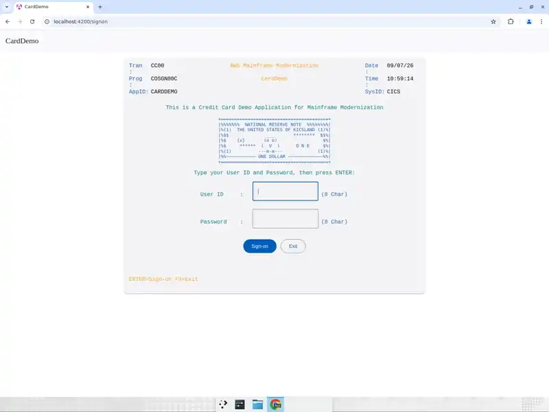

# S-01 AccountView — Online UI test report

| | |
|---|---|
| Stream | S-01 AccountView (CardDemo core), ONLINE, D-0019 |
| Revision under test | stream branch `devin/1788757216-cardemo-account-view-stream` @ `c64ecb1` (waves 1-4, PRs #95-#98 merged) |
| Runtime | Angular 18 dev server :4200 -> Spring Boot 3 :8080 -> **real PostgreSQL 16** (`carddemo-pg`, host port 5433), fixture imported with the `import` profile (50 accounts / 50 customers / 50 xrefs / 10 users) + `parity/wave4/coactvwc/seed_synthetic.sql` (accounts 901, 902, 903) |
| Tooling | Chrome for Testing 133, Node 22.12, Java 21, Maven 3.6 |
| Method | Playbook `!mf_online_ui_testing`; checklist `parity/ui/AccountView_ui_verification_checklist.md`; one continuous annotated recording + one full-window screenshot per case |
| Oracle | `app/bms/COSGN00.bms`, `COMEN01.bms`, `COACTVW.bms`; `app/cbl/COSGN00C.cbl`, `COMEN01C.cbl`, `COACTVWC.cbl`; `functional/CardDemo/AccountView_functional_requirement.md` (FR-01..FR-25); approved deviations DV-01..DV-07; `parity/wave4/coactvwc/expected_fixture.json` |
| Locale | English only (BMS literals are English; no second locale exists) |

## 1. Verdict

**PASS** — 29 UI scenarios executed: **28 PASS** (2 of them PASS-WITH-RISK), **1 minor defect (D-UI-01, keyboard order)**, 0 blocked.
Build/test suites on the merged stream branch are green (§5). No implementation, test or `functional/` file was modified.

FR coverage: FR-01..FR-22 and FR-25 verified in the browser (23/25); FR-23 and FR-24 (CSUTLDTC date utility) have no
screen and are covered by the wave-1 parity suite (`DateValidationServiceTest`) — not UI-verifiable, listed as a gap by design.

## 2. Scenario table

Evidence: `parity/ui/evidence/<case>.png`; recording `parity/ui/evidence/AccountView_ui_journey.mp4` (animated preview
`AccountView_ui_journey.webp`). Observed text is quoted exactly as rendered.

| Case | FR | Steps | Expected (cite) | Observed | Verdict | Conf |
|---|---|---|---|---|---|---|
| FR-01 | FR-01 | open `/` | empty focused User ID, masked password, `CC00`/`COSGN00C`, `mm/dd/yy`, `hh:mm:ss`, AppID/SysID, footer `ENTER=Sign-on  F3=Exit`, no error (`COSGN00C.cbl:80-83,145-157`; `COSGN00.bms`) | all present: `CC00`, `COSGN00C`, `CARDDEMO`, `CICS`, `09/07/26`, time, footer; focus in User ID; no message | PASS | high |
| FR-02 | FR-02 | Sign on with both blank | `Please enter User ID ...`, focus User ID (`:117-122`) | `Please enter User ID ...`; User ID focused | PASS | high |
| FR-03 | FR-03 | `USER0001`, blank password | `Please enter Password ...`, focus Password (`:123-127`) | `Please enter Password ...`; Password focused | PASS | high |
| FR-04 | FR-04 | `user0001` / `password` | upper-cased, sign-on succeeds (`:132-136`) | `Main Menu` shown | PASS | high |
| FR-05 | FR-05 | `USER0001` / `PASSWORD` | main menu; session holds id + type `U` (`:221-239`) | `Main Menu` shown; identity not painted on the menu (legacy map has no user-id field either) — identity carry verified indirectly by X-02 | PASS | high |
| FR-05b | Q-01 / B-0009 | `ADMIN001` / `PASSWORD` | type `A` lands on `/menu` (COADM01C excluded) with an unavailable notice | `Main Menu` + `Administration is not available in this release` | PASS | high |
| FR-06 | FR-06 | `USER0001` / `WRONGPW` | `Wrong Password. Try again ...`, focus Password (`:241-246`) | exact text; Password focused; stays on sign-on | PASS | high |
| FR-07 | FR-07 | `NOBODY01` / `PASSWORD` | `User not found. Try again ...`, focus User ID (`:247-251`) | exact text; User ID focused | PASS | high |
| FR-08 | FR-08 | Exit button, F3, Esc on sign-on | `Thank you for using CardDemo application...`, session ends (`:88-90,162-172`; `CSMSG01Y.cpy:18-19`) | exact text for all three; inputs removed; screen keeps header/footer and offers a `Sign on again` button (re-entry ≙ `EIBCALEN=0`) — already ruled informational in `parity/wave2/Wave2_parity_results.md` §5 | PASS-WITH-RISK | high |
| FR-09 | FR-09 | after sign-on | `CM00`/`COMEN01C`, 11 options `01. Account View` .. `11. Pending Authorization View`, footer `ENTER=Continue  F3=Exit`, option empty (`COMEN01C.cbl:208-220,262-303`; `COMEN02Y.cpy`) | all 11 options in order, header, footer, option blank | PASS | high |
| FR-10 | FR-10 | Continue with ``, `0`, `12`, `A` | `Please enter a valid option number...`, echo `00`,`00`,`12`,`0A` (`:117-134`) | exact text; echoes `00`, `00`, `12`, `0A` | PASS | high |
| FR-10b | Q-12 / B-0032 hard stop | option `5`, option `11` | `Option not available in this release`, no navigation | exact text; menu stays | PASS | high |
| FR-11 | FR-11 | `1`, ` 1`, `01`, `1 ` | Account View entry (`:117-125,177-187`) | each reaches `/accounts/view` `View Account` | PASS | high |
| FR-12 | FR-12 | Exit / F3 / Esc on menu | fresh sign-on; identity dropped (`:96-98,196-203`) | `/signon` shown; Back and direct `/menu` redirect to `/signon` | PASS | high |
| FR-13 | FR-13 | arrive via option 1 | `CAVW`/`COACTVWC`, `View Account`, empty focused account field, info `Enter or update id of account to display`, blank data, no error (`COACTVWC.cbl:353-360,431-458`) | all present | PASS | high |
| FR-14 | FR-14 | Search with empty field; with `*` | red `No input received`, field red `*`, no data (`:628-642,561-565`) | red `No input received`; red `*`; no data (both inputs) | PASS | high |
| FR-15 | FR-15 | `00000000000`, `1234567890A`, `1234567890` | red `Account Filter must  be a non-zero 11 digit number`, value echoed (`:666-676`; Q-02) | exact text (two spaces) for all three; values echoed; no data | PASS | high |
| FR-16 | FR-16 | `00000000099` | `Account:00000000099 not found in Cross ref file.  Resp:.. Reas:..`, no data (`:741-758`) | `Account:00000000099 not found in Cross ref file.  Resp:0000000013 Reas:0000`; blocks blank | PASS | high |
| FR-17 | FR-17 / DV-01 | `00000000901` | `Account:00000000901 not found in Acct Master file.Resp:.. Reas:..`, **no** account/customer block (`:786-807`; D-0032 b) | `Account:00000000901 not found in Acct Master file.Resp:0000000013 Reas:0000`; both blocks blank | PASS | high |
| FR-18 | FR-18 | `00000000902` | `CustId:999999902 not found in customer master.Resp: .. REAS:..`, account block shown, customer blank (`:836-857,471-493`) | `CustId:999999902 not found in customer master.Resp: 0000000013 REAS:0000000`; account populated, customer blank | PASS | high |
| FR-19 | FR-19 / DV-05 / DV-06 | `00000000027` | all fields = `expected_fixture.json` screen block (`:471-534`) | 27/27 displayed fields match (§3); FICO `078`; ZIP `07923-8822`; phones full; group `A000000000`; info line unchanged; no error | PASS | high |
| FR-20 | FR-20 | `docker stop carddemo-pg`, search `00000000027` | red `File Error: READ     on CXACAIX   returned RESP ..,RESP2 ..`, no data (`:759-768,86-105`) | `File Error: READ     on CXACAIX   returned RESP 0000000016,RESP2 0000000000`; data cleared | PASS | high |
| FR-21 | FR-21 hard stop | successful search, then Exit / F3 / Esc | main menu; search state gone (`:324-352`) | `Main Menu`; re-entry shows empty entry state | PASS | high |
| FR-22 | FR-22 | PG stopped, sign on `USER0001`/`PASSWORD` | `Unable to verify the User ...`, focus User ID (`COSGN00C.cbl:252-256`) | exact text; User ID focused | PASS | high |
| FR-25 | FR-25 / DV-03 | F1, F2 on sign-on and menu | no `Invalid key` text (dropped, D-0031); browser-native keys out of scope (D-0042 c) | no message, screens intact; F1 opens Chrome Help tab (browser-native) | PASS-WITH-RISK | high |
| X-01 | FR §7 session / B-0027 | fresh session opens `/menu`, `/accounts/view` | redirect to `/signon` | both redirected to `/signon` | PASS | high |
| X-02 | DV-02 / B-0027 | sign on -> menu -> account view -> reload | still signed on | stays on `/accounts/view` | PASS | high |
| X-03 | FR-12 | menu Exit, then browser Back | no menu | stays on `/signon` | PASS | high |
| X-04 | a11y / BMS field order | Tab through each screen; label binding; focus visibility | order = BMS unprotected-field order then buttons; every input labelled; focus visible | labels bound (`for`/`id`) on all 4 inputs; focus visible; sign-on and account-view order correct; **menu: `01. Account View` button receives focus before the option input** | FAIL (D-UI-01, minor) | high |

## 3. FR-19 field-by-field (account `00000000027`)

| Field | Expected (`expected_fixture.json`, DV-05/06 variant) | Observed |
|---|---|---|
| Account number / Active | `00000000027` / `Y` | same |
| Opened / Expiry / Reissue | `2012-09-30` / `2025-07-13` / `2025-07-13` | same |
| Credit limit / Cash credit limit / Current balance | `+      5,572.00` / `+      2,075.00` / `+        284.00` | same |
| Current cycle credit / debit | `+           .00` / `+           .00` | same |
| Account group (DV-06) | `A000000000` | same |
| Customer id / SSN / DOB / FICO | `000000027` / `980-16-1210` / `1986-11-08` / `078` | same |
| First / middle / last | `Ward` / `Henri` / `Jones` | same |
| Address 1 / 2 / city / state | `210 Amaya Turnpike` / `Suite 180` / `Port Dwight` / `GU` | same |
| ZIP (DV-05) / country | `07923-8822` / `USA` | same |
| Phone 1 / 2 (DV-05) | `(935)027-1145` / `(103)537-5007` | same |
| Government id / EFT id / primary holder | `00000000000881558757` / `0050024139` / `Y` | same |

## 4. Defects and observations

| Id | Severity | Case | Description | Cite | Evidence |
|---|---|---|---|---|---|
| D-UI-01 | minor (accessibility / keyboard order) | X-04 | On the main menu the implemented option `01. Account View` is rendered as a focusable button placed before the option input, so Tab order is `01. Account View -> option -> Continue -> Exit`. The BMS map has a single unprotected field (`OPTION`), so the expected order is `option -> Continue -> Exit`. Mouse/keyboard behaviour is otherwise correct; the clickable option is a target-state convenience not present in the legacy map. | `app/bms/COMEN01.bms` (`OPTION` is the only `UNPROT` field); `frontend/src/app/features/menu/menu.component.html:29-40` | `evidence/X-04.png` |
| O-01 | observation (ruled informational in wave 2) | FR-08 | After Exit the sign-on screen keeps header/footer and shows a `Sign on again` button; legacy ends the conversation with a plain-text screen. Recorded in `parity/wave2/Wave2_parity_results.md` §5 as not a parity defect. | `COSGN00C.cbl:162-172` | `evidence/FR-08.png` |
| O-02 | cosmetic | FR-01/FR-08 | Sign-on header labels `Tran :`, `Prog :`, `Date :`, `Time :` wrap the colon onto a second line at the tested viewport (1568 px wide); values are present and correct. Menu and Account View headers do not wrap. | `COSGN00.bms` label literals | `evidence/FR-01.png` |
| O-03 | observation | FR-05 | Neither the legacy `COMEN01` map nor the target menu paints the signed-on user id, so "session carries user id" is only observable indirectly (X-02, `GET /api/auth/session` in wave-3/4 parity). | — | — |

No defect blocks the journey; none contradicts an approved deviation (DV-01..DV-07 all observed as specified).

## 5. Build / test suites on the merged stream branch (`c64ecb1`)

| Suite | Command | Result |
|---|---|---|
| Backend | `cd backend && JAVA_HOME=/usr/lib/jvm/java-21-openjdk-amd64 mvn -B clean verify` (H2 unit profile + Testcontainers PostgreSQL 16 integration tests, Docker) | `BUILD SUCCESS`, 184 tests, 0 failures, 0 errors, 0 skipped |
| Frontend build | `cd frontend && npm ci && npm run build` (Node 22.12) | success, bundle generated |
| Frontend unit | `npx ng test --watch=false --browsers=ChromeHeadless` | Karma: 83 of 83 SUCCESS |

## 6. FR coverage

| FR | UI verified | Note |
|---|---|---|
| FR-01..FR-22 | yes | 22/22, incl. FR-20/FR-22 with a real database outage |
| FR-23, FR-24 | no (by design) | CSUTLDTC has no screen; covered by `DateValidationServiceTest` (wave 1 parity) |
| FR-25 | yes (as DV-03) | no `Invalid key` text is producible in a browser; browser-native keys out of scope |

Coverage: 23/25 requirements verified end to end in the browser; 2/25 not UI-verifiable and covered at unit level. Extra
scenarios X-01..X-04 cover session/route guarding and keyboard accessibility.

## 7. Evidence

- `parity/ui/AccountView_ui_verification_checklist.md` — the case set and how to run/capture.
- `parity/ui/evidence/AccountView_ui_journey.mp4` — one continuous annotated recording (3 min 25 s) of the whole journey.
- `parity/ui/evidence/AccountView_ui_journey.webp` — animated preview of the same recording.
- `parity/ui/evidence/FR-01.png .. FR-22.png, FR-05b.png, FR-10b.png, FR-25.png, X-01.png .. X-04.png` — one full-window screenshot per case.

## 8. Divergence / cross-check note

No cross-check branch (`devin/batch-a-s02-account-view`, `devin/1787242078-carddemo-premigration`) was consulted; all
expectations come from the stream FR, the BMS/COBOL source and the wave-4 expected fixture.
